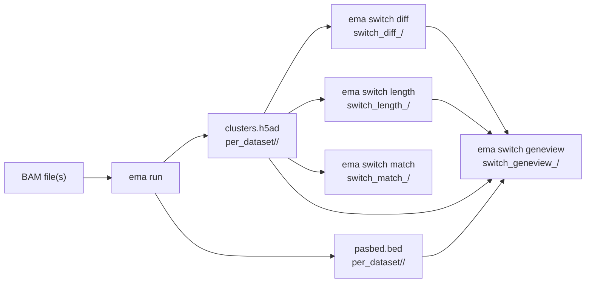

# CLI Reference

PeakATail is invoked through the `ema` command. All subcommands share a common
set of logging, threading, and plotting flags documented on the individual pages.
Run any subcommand with `--help` to see its full flag list.

## Commands at a glance

| Command | Purpose |
|---|---|
| [`ema run`](run.md) | Run the full pipeline: BAM input → peak calling → clustering → cluster matching |
| [`ema switch diff`](switch-diff.md) | Differential APA test (Fisher or NB regression) across cluster pairs |
| [`ema switch length`](switch-length.md) | 3' UTR shortening/lengthening quantification (PDUI, proportion, entropy) |
| [`ema switch match`](switch-match.md) | Cross-dataset cluster matching (marker overlap, MNN, or Jaccard) |
| [`ema switch geneview`](switch-geneview.md) | Gene-track visualisation: per-cluster PAS coverage panels |

## Pipeline flow



## Output directory layout

All commands write under `peakatail_runs/`. The run command creates:

```
peakatail_runs/<name>_<timestamp>/
  per_dataset/<id>/
    raw/                   # unfiltered BEDs and MTX
    pasbed.bed             # filtered PAS coordinates (BED6)
    posbed.bed / negbed.bed
    filtered_cb.tsv        # barcodes passing min_read filter
    annotated_matrix.mtx   # sparse count matrix post annotation
    preprocessed.h5ad      # filtered AnnData before clustering
    clusters.h5ad          # final AnnData with leiden labels
    pas_gene.tsv           # PAS-to-gene mapping
  peakatail_<ts>.log
  run_config.json
  resources.jsonl          # per-second RSS + CPU samples
  tile_timings.json        # per-tile peak-calling wall times
```

Switch subcommands auto-route their output **inside** the originating run
directory when `--output` is left at its default and the input `--h5ad` files
come from a recognisable `peakatail_runs/<run>/` path. See each command page
for the exact output subdirectory name.

## Common flags

These flags are available on every command:

| Flag | Default | Description |
|---|---|---|
| `--threads` | auto | Max parallel workers. Absolute ceiling for `ResourceManager`. |
| `-v` / `-vv` | — | Increase verbosity (`-v` = DEBUG for `ema.*`, `-vv` = DEBUG everywhere). |
| `-q` / `--quiet` | off | WARNING and up only. Overrides `-v`. |
| `--log-level` | INFO | Logger level string or `logger.name=LEVEL` (comma-separated). |
| `--no-log-file` | off | Do not write the per-run `.log` file next to outputs. |
| `--no-progress` | off | Suppress Rich progress bars. |
| `--config` / `-c` | — | YAML config file. CLI flags override individual keys. |
| `--output` / `-o` | command default | Output directory name. Timestamp appended automatically. |
| `--plot-engine` | `matplotlib` | `matplotlib`, `plotly`, `both`, `none`, or comma list. |
| `--plot-format` | `all` | Restrict output formats: `png`, `svg`, `html`, or comma list. |
| `--no-plots` | off | Disable all plotting (alias for `--plot-engine none`). |
