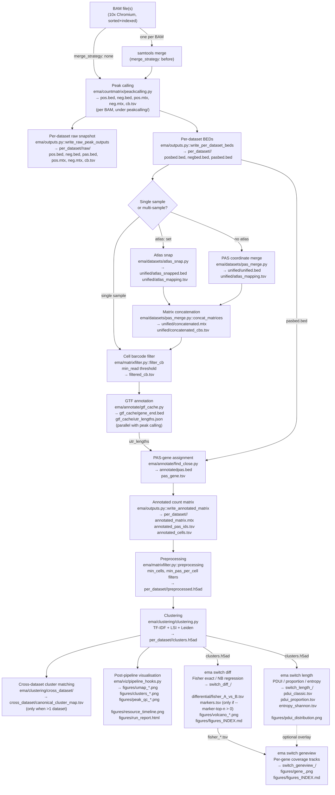

# Data flow

This page shows how data moves through PeakATail from raw BAM files to differential APA results. The diagram covers both the single-sample path (one BAM in `datasets:`) and the multi-sample path (two or more datasets), and the switch subcommands that run after the main pipeline.

## Pipeline diagram

## Stage annotations

### BAM input

PeakATail reads sorted, indexed BAM files produced by Cell Ranger or STARsolo. Each BAM must have cell barcodes in the tag specified by `barcode_tag` (default `CB`). UMI tags are not used; PeakATail counts raw read 3' ends, not UMI-deduplicated molecules.

### Peak calling

`ema/countmatrix/peackcalling.py` iterates reads strand by strand. For each position where a read's 3' end falls, it increments a per-position coverage array. Peaks are detected from this coverage profile using the strategy class set by `--peak-strategy` (default `original`). Each peak emits one or more PAS coordinates (up to `max_pas` per peak, separated by at least `pas_gap` bp). Output is one BED file and one MatrixMarket sparse count matrix per strand per BAM.

### Atlas snap vs coordinate merge

In the multi-sample path, all per-BAM BEDs must be unified to a common coordinate space before the matrices can be added together.

- **Atlas snap** (`atlas:` key set): each called coordinate is replaced by the nearest entry in the reference BED within `atlas_distance` bp. Coordinates that do not match any atlas entry are discarded. This is the recommended approach when a validated poly(A) site database is available (e.g. PolyASite 2.0 or GENCODE).
- **Coordinate merge** (no atlas): nearby PAS from different datasets are merged if they fall within `pas_gap` bp of each other. A representative coordinate (median position) is selected. This is less precise but works without an external reference.

### Clustering

`ema/clustering/clustering.py` dispatches to one of two built-in strategies:

- `leiden_tfidf` (default): TF-IDF normalisation (Signac Method 1) → SVD/LSI dimensionality reduction with depth-correlation filtering (ArchR-style) → k-NN graph → Leiden community detection.
- `leiden_libsize`: library-size normalisation → PCA on highly variable PAS → k-NN graph → Leiden.

The resolution parameter controls cluster granularity; higher values produce more clusters.

### Switch subcommands

`ema switch diff`, `ema switch length`, and `ema switch geneview` are independent commands that read `clusters.h5ad` as input. They write their results inside a timestamped subdirectory under the original run directory, keeping every analysis self-contained.
