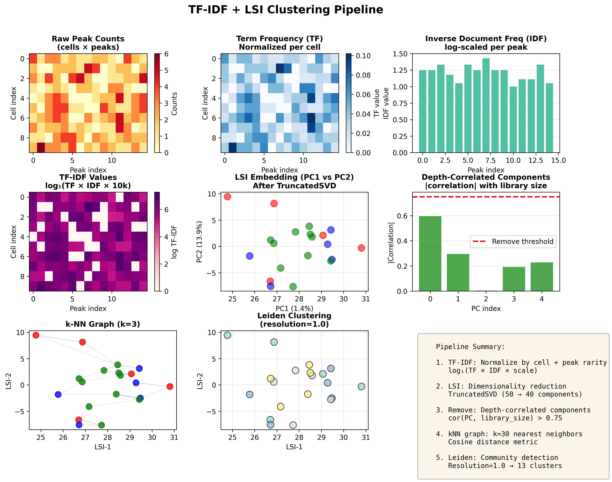

# Clustering strategies

Clustering groups cells by their poly(A) site (PAS) usage patterns so that
downstream differential APA tests have biologically meaningful contrasts. The
input to every clustering strategy is an AnnData object whose rows are cells
and whose columns are PAS peaks (cells x PAS). The output is the same AnnData
with `obs["leiden"]` populated and `obsm["X_umap"]` computed for visualization.

Each strategy implements three internal phases executed by the orchestration
layer in `ema/clustering/clustering.py`: `normalize`, `reduce_dims`, and
`cluster`. Researchers interact with the strategy only through CLI flags or
YAML keys; the three-phase split is an implementation detail.

---

## `leiden_tfidf` {#leiden_tfidf}

**Question:** Which groups of cells share a similar pattern of poly(A) site
usage across the transcriptome, treating each PAS as a "word" and each cell
as a "document"?

### Algorithm

1. Compute total read counts per cell and store in `obs["total_counts"]`.
2. Apply Signac Method 1 TF-IDF: for each cell-PAS entry,
   `TF = count / cell_total` and `IDF = n_cells / cells_with_this_PAS`.
   The transformed value is `log1p(TF * IDF * scale_factor)`.
3. Run Truncated SVD (randomized algorithm) to produce an LSI embedding of
   shape (n_cells, n_components). L2-normalize each row.
4. Remove LSI components whose Pearson |r| with total read counts exceeds
   `depth_corr_threshold`. This is the ArchR-style depth-correlation filter
   that prevents sequencing depth from driving cluster separation.
5. Build a cosine-distance k-nearest-neighbor graph on the filtered LSI
   embedding using `n_neighbors` neighbors across `n_dims` dimensions.
6. Run UMAP for 2-D visualization and Leiden community detection
   (flavor=`igraph`, `n_iterations=2`, undirected) at the specified
   `resolution`.



*The six steps above, on a deliberately tiny illustrative matrix (15 PAS ×
10 cells) so each transform stays readable: raw counts → per-cell TF → per-PAS
IDF → `log1p(TF × IDF × scale)` → the LSI embedding → the depth-correlation
filter (components whose |r| with library size exceeds
`depth_corr_threshold`, 0.75, are dropped) → the cosine k-NN graph → Leiden
communities. The matrix is synthetic; the panel exists to show the transforms,
not to report a result.*

### Inputs and outputs

**Inputs:**

- AnnData with `X` = sparse (cells x PAS) count matrix
- Requires at least 3 cells and 3 PAS (raises `ValueError` otherwise)

**Outputs stored in AnnData:**

| Key | Location | Content |
|---|---|---|
| `total_counts` | `obs` | Pre-normalization read sum per cell |
| `X_lsi` | `obsm` | L2-normalized LSI embedding after depth-correlation filtering |
| `lsi_kept_components` | `uns` | Array of component indices that passed the filter |
| `lsi_variance_ratio` | `uns` | SVD explained variance ratios |
| `leiden` | `obs` | Cluster label strings |
| `X_umap` | `obsm` | 2-D UMAP coordinates |

### Tunable hyperparameters

| Parameter | Default | CLI flag | YAML key | Description |
|---|---|---|---|---|
| `resolution` | 1.0 | `--resolution` | `resolution` | Leiden resolution. Higher values produce more, smaller clusters. |
| `n_components` | 50 | `--n-svd-components` | `n_svd_components` | SVD components computed before depth-correlation filtering. |
| `n_dims` | 40 | `--n-pcs` | `n_pcs` | LSI dimensions passed to the kNN graph (must be <= n_components). |
| `n_neighbors` | 30 | `--n-neighbors` | `n_neighbors` | kNN graph size. Larger values smooth cluster boundaries. |
| `scale_factor` | 10000 | `--tfidf-scale-factor` | `tfidf_scale_factor` | TF-IDF scale factor. Adjust when counts have very different dynamic range. |
| `depth_corr_threshold` | 0.75 | `--depth-corr-threshold` | `depth_corr_threshold` | Pearson |r| threshold above which an LSI component is dropped. Set to 1.0 to disable. |
| `random_seed` | 42 | `--random-seed` | `random_seed` | RNG seed for SVD and Leiden. |

### Interpretation

A well-formed result has clusters of varying sizes (not all cells in one
cluster, not every cell its own cluster). Inspect `cluster_sizes` and
`umap` figures. If you see one giant cluster and many singletons, lower
`resolution`. If clusters look random on the UMAP (neighboring cells in
different colors), raise `n_neighbors` or lower `depth_corr_threshold`.

The `lsi_kept_components` key in `.uns` tells you how many components
survived depth filtering. If fewer than 5 survive, your data may have
strong library-size confounding; try `leiden_libsize` instead.

### Limitations

- PAS counts have higher dynamic range than scATAC (0-100+ vs 0-3). The
  `sublinear_tf=True` approach (log1p on the TF term) is implicit in the
  Signac Method 1 formula but does not fully account for very high-count PAS.
- Leiden clustering is non-deterministic across versions of the `igraph`
  C library even with a fixed seed. Use `random_seed` for reproducibility
  within a single software environment.
- With fewer than ~200 cells, depth-correlation filtering may remove too many
  components. Set `depth_corr_threshold=1.0` to disable it.

---

## `leiden_libsize` {#leiden_libsize}

**Question:** Which groups of cells share similar PAS usage, using the
conventional scRNA-seq normalization pipeline?

### Algorithm

1. Library-size normalize each cell to `target_sum=10,000` (CPM-equivalent),
   then apply `log1p`.
2. Select the top `n_top_hvg` highly variable PAS using
   `min_mean=0.005, max_mean=5, min_disp=0.3`. Subset the matrix to these
   PAS.
3. Scale each PAS to zero mean and unit variance (capped at `max_value=10`).
4. Run PCA to `n_comps` components.
5. Build a Euclidean kNN graph on `n_pcs` PCA dimensions with `n_neighbors`
   neighbors.
6. Run UMAP and Leiden (same settings as `leiden_tfidf`).

### Inputs and outputs

**Inputs:**

- AnnData with `X` = sparse (cells x PAS) count matrix

**Outputs stored in AnnData:**

| Key | Location | Content |
|---|---|---|
| `X_pca` | `obsm` | PCA embedding |
| `leiden` | `obs` | Cluster label strings |
| `X_umap` | `obsm` | 2-D UMAP coordinates |

### Tunable hyperparameters

| Parameter | Default | CLI flag | YAML key | Description |
|---|---|---|---|---|
| `resolution` | 1.0 | `--resolution` | `resolution` | Leiden resolution. |
| `n_comps` | 50 | `--n-svd-components` | `n_svd_components` | PCA components computed before the kNN step. |
| `n_pcs` | 40 | `--n-pcs` | `n_pcs` | PCA components used for the kNN graph (must be <= n_comps). |
| `n_top_genes` | 2000 | `--n-top-hvg` | `n_top_hvg` | Highly variable PAS selected before PCA. |
| `n_neighbors` | 10 | `--n-neighbors` | `n_neighbors` | kNN graph size. |
| `random_seed` | 42 | `--random-seed` | `random_seed` | RNG seed. |

### Interpretation

This strategy uses a smaller default `n_neighbors` (10 vs 30) because PCA
Euclidean distances behave differently from cosine LSI distances in high
dimensions. If UMAP looks overly fragmented, raise `n_neighbors` to 20-30.

HVG selection can exclude informative PAS if `n_top_hvg` is too small. For
experiments with few cells (< 500), consider raising `min_mean` slightly or
disabling HVG selection by setting `n_top_hvg` to the full feature count.

### Limitations

- Library-size normalization assumes all cells have similar total transcript
  content. When cells differ dramatically in capture efficiency (a known
  problem in poly(A) sequencing), `leiden_tfidf` is preferred.
- PCA is sensitive to outlier PAS with very high variance after scaling
  (clipped at `max_value=10`). Verify the `peak_qc` figure first.

---

## `external` {#external}

**Question:** How do pre-computed cluster labels from a gene-expression
analysis (Seurat, Scanpy, CellRanger) align with PAS usage patterns?

### Algorithm

1. Apply a light log-normalization (`normalize_total` + `log1p`) solely to
   produce a meaningful UMAP for visualization. No dimensionality reduction
   drives the cluster labels.
2. Run PCA to up to 50 components for UMAP only.
3. Load the user-provided CSV file: column 0 = cell barcode, column 1 =
   cluster label (no header expected).
4. Match barcodes between the AnnData and the CSV. Cells with no matching
   barcode receive the label `"unassigned"`.
5. Assign matched labels to `obs["leiden"]` as a Categorical.
6. Build a kNN graph and compute UMAP for visualization.

### Inputs and outputs

**Inputs:**

- AnnData with `X` = sparse (cells x PAS) count matrix
- CSV file at `labels_path`: two columns (barcode, cluster), no header

**CSV format:**

```
ACGTACGTACGT-1,T_cell
TTGATCGATCGA-1,B_cell
GGCATCGATCGA-1,Monocyte
```

**Outputs stored in AnnData:**

| Key | Location | Content |
|---|---|---|
| `leiden` | `obs` | Cluster labels from CSV (or `"unassigned"`) |
| `X_umap` | `obsm` | 2-D UMAP coordinates for visualization |

### Tunable hyperparameters

| Parameter | Default | CLI flag | YAML key | Description |
|---|---|---|---|---|
| `labels_path` | required | `--external-clusters` | `external_clusters` | Path to the two-column CSV file. No default; the strategy raises `ValueError` if absent. |
| `random_seed` | 42 | `--random-seed` | `random_seed` | RNG seed for UMAP. |

### Interpretation

Cells labeled `"unassigned"` appear in the UMAP but are excluded from
differential APA tests. A high fraction of unassigned cells (> 10-20%)
usually means a barcode format mismatch (e.g., the CSV has `sample_ACGT`
while the h5ad uses `ACGT-1`). Check the barcode convention with
`adata.obs_names[:5]` vs the first column of the CSV.

### Limitations

- Requires barcode-level overlap between the gene-expression clustering and
  the PAS count matrix. Barcodes are matched by exact string equality after
  AnnData loading; no prefix stripping is applied.
- UMAP computed from PCA on log-normalized PAS data will not necessarily
  match the UMAP from the source gene-expression analysis. Use it only as
  a layout for coloring by the imported labels, not for interpreting PAS
  structure.
