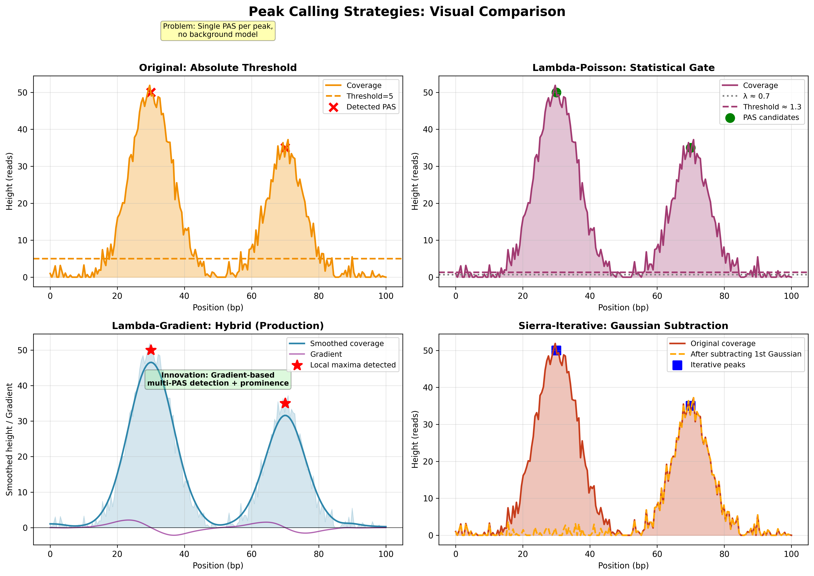
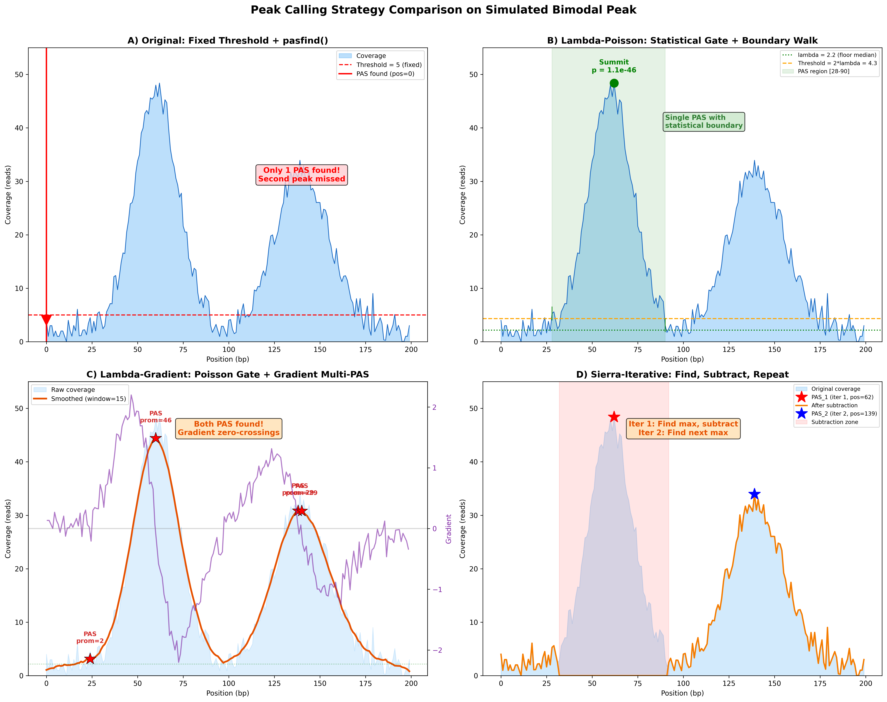
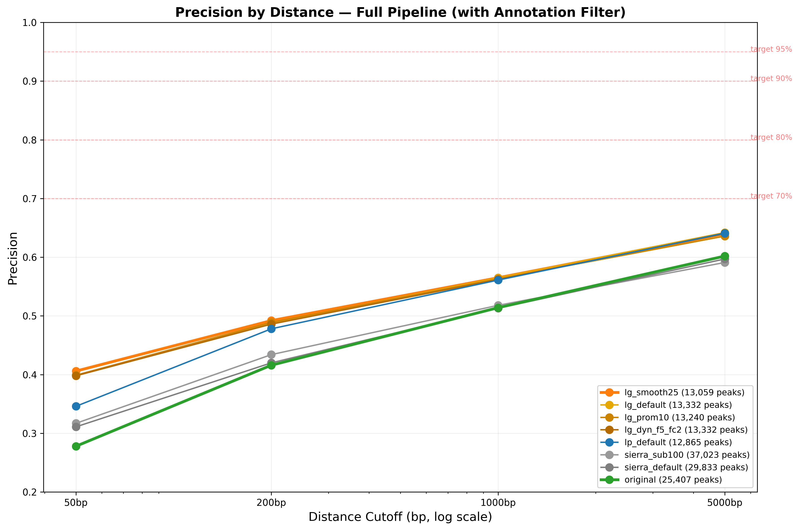
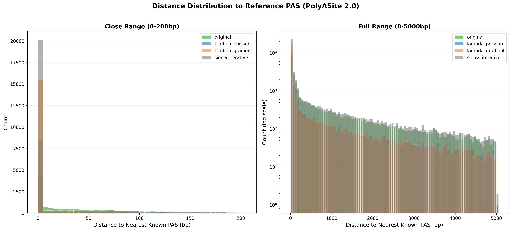
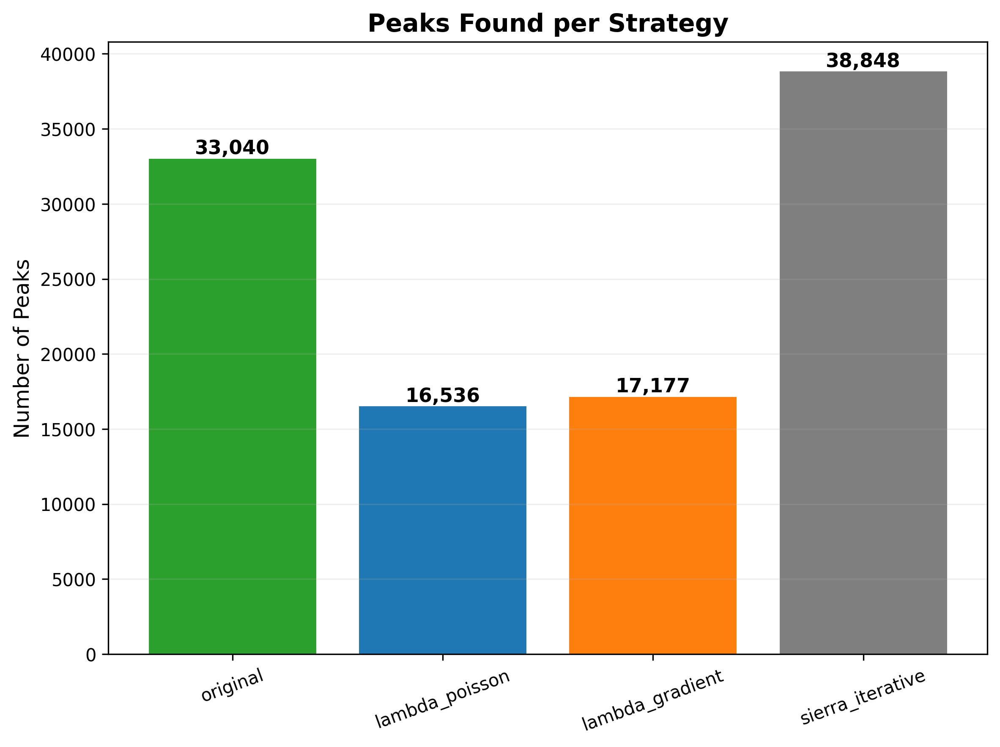
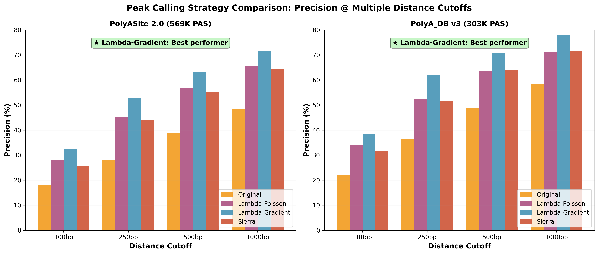
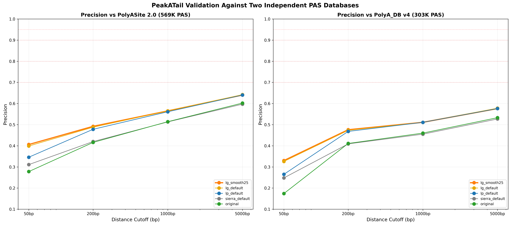

# Peak-calling strategies

The peak-calling stage finds polyadenylation sites (PAS) within each merged
"peak region" (a stretch of contiguous 3'-end coverage). PeakATail ships five
registered strategies — each implements `PeakFinderStrategy` in
`ema/strategies/`, each registered via `@register("<name>")`.

Selection is CLI-level: `ema run --peak-strategy <name>` or `strategy:` in the
YAML config.

## Strategy overview

| Strategy | Class | Best for | Multi-PAS? |
|---|---|---|---|
| `original` | `OriginalStrategy` | A/B baseline; matches the legacy `Peak.pasfind()` output exactly | 1 PAS per region only |
| `lambda_poisson` | `LambdaPoissonStrategy` | MACS2-style single-peak detection with local background | 1 PAS per region |
| `sierra_iterative` | `SierraIterativeStrategy` | Recovering multiple PAS per 3' UTR (closest to Sierra, Patrick et al. 2020) | Yes — iterative subtraction |
| `lambda_gradient` | `LambdaGradientStrategy` | Multiple-PAS detection with Poisson significance per candidate | Yes — gradient-based candidate detection + per-summit test |
| `clip_seeded` | `ClipSeededStrategy` | **Accuracy.** Seeds PAS from read-level poly(A) soft clips and reports coverage-only peaks as an explicit second tier | Yes — one PAS per clip cluster, plus tier-2 coverage peaks |

The first four strategies see only coverage shape and cell barcodes.
`clip_seeded` is the only one that uses orthogonal, read-level evidence; see
[its section](#clip_seeded) for why that matters and what it costs.


*Strategy-level comparison across the benchmark set: number of detected PAS,
agreement with reference annotation, and runtime. Source: PeakATail Technical
Report (Mar 2026), Figure 2.*


*One-glance summary of each strategy's algorithmic idea — summit detection
(original / lambda_poisson) vs iterative subtraction (sierra_iterative) vs
gradient + significance (lambda_gradient).*

---

## `original` {#original}

**Registered name:** `original`
**Source:** `ema/strategies/original.py`

Wraps the legacy `Peak.pasfind()` method unchanged. Produces IDENTICAL output
to the pre-refactor PeakATail code path. Exists so new strategies can be
evaluated against a frozen baseline.

### Algorithm
1. Call `peak.pasfind()` on each peak region.
2. Return the (pas_1, pas_2) tuple — typically the single summit position.

### Tunable hyperparameters

None. By design — this strategy exists to be deterministic.

### When to use

A/B comparisons against new strategies. Reproducing old results from a previous
PeakATail version exactly.

### Limitations

Returns at most **one PAS per peak region**, even when a region clearly
contains multiple distal sites. This was a recurring source of recall loss
before the iterative strategies were added.

---

## `lambda_poisson` {#lambda_poisson}

**Registered name:** `lambda_poisson`
**Source:** `ema/strategies/lambda_poisson.py`

MACS2-style: compute a local lambda from the region's background positions,
then test the summit's height against `Poisson(lambda)`. Keep the summit as a
PAS only if the one-sided p-value beats `alpha`.

### Algorithm
1. Identify the summit position (max coverage) in the region.
2. Compute `lambda` from "floor" positions — positions with depth below
   `floor_fraction × max_height`. The `lambda_method` controls aggregation
   (`"median"`, `"percentile20"`, or `"global"`).
3. Test `H₀: summit_depth ~ Poisson(lambda)` one-sided.
4. Discard if `p ≥ alpha` or `summit_depth < min_height`.

### Tunable hyperparameters

| Name | Default | Description |
|---|---|---|
| `lambda_method` | `"median"` | Background aggregator — `median` is robust; `percentile20` is more conservative |
| `min_height` | 20 | Hard floor on summit depth before any p-value test |
| `alpha` | 0.05 | Poisson p-value threshold |
| `floor_fraction` | 0.1 | Positions below this fraction of max-height define the background |

### When to use

Single-PAS regions where you want a statistical significance filter on noise
peaks. Good baseline for benchmarking precision.

### Limitations

Returns **one PAS per region** — multiple distal sites in the same UTR will
share a single called summit. Use `sierra_iterative` or `lambda_gradient` for
multi-PAS recovery.

---

## `sierra_iterative` {#sierra_iterative}

**Registered name:** `sierra_iterative`
**Source:** `ema/strategies/sierra_iterative.py`

Based on Sierra (Patrick et al., *Genome Biology* 2020). Iteratively peels off
the dominant peak from the coverage profile, then repeats — naturally surfaces
multiple PAS per UTR.

### Algorithm
1. Find the position of maximum coverage; record as a PAS.
2. Zero out a `±subtraction_window` neighbourhood around that position.
3. Repeat until either the remaining max falls below `min_height` AND below
   `min_fraction × original_max`, or `max_pas` PAS have been called.

### Tunable hyperparameters

| Name | Default | Description |
|---|---|---|
| `subtraction_window` | 300 | bp zeroed-out on each side of every called summit |
| `min_height` | 20 | Absolute minimum coverage for a position to be considered |
| `max_pas` | 5 | Hard cap on PAS per region (safety) |
| `min_fraction` | 0.1 | Stop when next peak's height < this × original max |

### When to use

Whenever you want **multiple PAS per UTR** — the typical APA-discovery setup.
The closest analog to the well-validated Sierra method.

### Limitations

- No statistical significance test; iteration stops on raw-height thresholds
  alone. Use `lambda_gradient` if you want both multi-PAS recovery AND a
  per-summit p-value.
- The subtraction_window is uniform regardless of underlying peak width —
  fine for typical 100–300 bp PAS clusters but may over-merge in
  longer-isoform regions.

---

## `lambda_gradient` {#lambda_gradient}

**Registered name:** `lambda_gradient`
**Source:** `ema/strategies/lambda_gradient.py`

Hybrid: gradient-based candidate detection (smoothed coverage local maxima),
then per-summit Poisson significance with locally estimated lambda.

### Algorithm
1. Smooth the coverage profile with a centered moving average of width
   `smooth_window`.
2. Identify all positions where the first derivative crosses from positive to
   non-positive — these are candidate summits.
3. For each candidate: estimate local `lambda` from neighbouring floor
   positions and run a one-sided Poisson p-value test.
4. Apply `min_height` floor and `alpha` significance filter.
5. Merge candidates within `merge_window` (so two summits 50 bp apart from
   noise oscillation collapse to one).

### Tunable hyperparameters

| Name | Default | Description |
|---|---|---|
| `smooth_window` | typical 11 bp | Width of the moving-average smoother |
| `min_height` | 20 | Absolute minimum summit depth |
| `alpha` | 0.05 | Per-summit Poisson p-value threshold |
| `lambda_method` | `"median"` | Background aggregator (same as lambda_poisson) |
| `merge_window` | typical 100 bp | Merge summits closer than this |

### When to use

When you want multi-PAS detection **and** a statistical significance filter on
each individual called PAS. The most expensive strategy per region (smoothing +
per-summit test) but the most defensible for downstream differential testing.

### Limitations

Smoothing trades sensitivity for noise robustness — narrow PAS (<10 bp) can be
suppressed by the moving average. If you see PAS recall drop on short
isoforms, reduce `smooth_window`.

---

## `clip_seeded` {#clip_seeded}

**Registered name:** `clip_seeded`
**Source:** `ema/strategies/clip_seeded.py`, `ema/countmatrix/polya.py`

The only strategy that uses evidence other than coverage shape. PAS candidates
are **seeded from read-level poly(A) soft clips** — the non-templated A (or T,
on the minus strand) tail a read carries when it was sequenced through the
cleavage site — rather than being read off the coverage profile alone.

### Why seeding and not filtering

On the pbmc_10k_v3 BAM, 1.152% of CB-bearing reads carry a qualifying clip and
**73.9%** of those clip sites fall within 100 bp of a PolyASite 2.0 site (the
same statistic for an arbitrary read 3' end is 13.9%). But **~60% of that clip
evidence lies outside every coverage-peak window**, so no post-hoc filter on
coverage peaks can reach it. Candidates have to start from the clips.

### Algorithm

1. During peak calling, every read that passes `read_check` is measured with
   `polya.clip_site()`; qualifying clips accumulate per chromosome (this is
   caller-level, not per-peak — a strategy only ever sees one peak window).
2. Clip sites are clustered by single linkage at `--polya-seed-window` (25 bp).
3. Each cluster clearing `--polya-min-umis` distinct `(barcode, UMI)`
   molecules is emitted as a **tier-1** PAS at the cluster's read-weighted
   **modal** position, as the 1-bp interval `[mode, mode+1)`. Molecules —
   not reads — are the support unit: a PCR stack of ten reads is one
   molecule. Cluster geometry (membership and the mode) is a pure function
   of the accepted clip reads, so changing the support unit or the gate can
   drop a PAS but never moves one.
4. The inner coverage strategy (`--peak-strategy clip_seeded` uses
   `lambda_gradient` by default) still runs; its PAS that overlap no tier-1
   cluster are emitted as **tier 2**, tagged `coverage_only`.
5. Both tiers go to `pasbed.bed` as ordinary BED6 rows. The **tier tag is BED
   column 5**: distinct clip molecules, so `score == 0` means coverage-only.
   `--polya-mode filter` drops exactly that tier. The raw clip-read count,
   the `-F 3844` counts and the matrix-row read count are written per PAS to
   the `pas_support.tsv` sidecar (see `docs/cli/run.md`), so BED6 stays BED6.
6. **Counting.** A tier-1 row is counted from the reads that pile up at its
   cleavage site, never from its clip reads alone (those are ~1% of the
   reads — column 5 keeps them as the support annotation). A cluster that
   suppresses a coverage candidate takes that candidate's `cb_positions`
   counts, restricted to its partition of the candidate (several clusters
   split a candidate at the midpoints between their anchors, exactly like
   `find_pas` splits a multi-PAS peak); every cluster additionally counts
   the accepted read ends inside `--polya-count-window` (default
   `[site - seq_len, site + 25]`, transcript orientation) that belong to no
   coverage candidate, clipped at the midpoint to its neighbours — so no
   read is counted twice and the coverage strategy's mass is a floor.
   Tier-2 rows are the coverage strategy's rows unchanged. A cluster left
   with nothing by both sources falls back to its own clip reads, and that
   fallback is midpoint-clipped and candidate-excluded the same way (a read
   end past the midpoint is the neighbour's), so such a row can legitimately
   come out empty rather than double-counted.

### Tunable hyperparameters

| Flag | Default | Effect |
|---|---|---|
| `--polya-min-clip` | 6 | Minimum soft-clip length AND minimum A/T run flush against the alignment boundary |
| `--polya-min-purity` | 0.8 | Minimum A (or T) fraction over the clipped bases |
| `--polya-seed-window` | 25 | Single-linkage gap for clustering clip sites |
| `--polya-min-umis` | 1 | Minimum distinct `(barcode, UMI)` molecules per emitted cluster (deprecated alias: `--polya-min-reads`) |
| `--polya-clip-filter` | `none` | `f3844` restricts the molecule count (and therefore the gate, the score and the tier tag) to reads passing samtools `-F 3844`; it drops clusters whose evidence is entirely secondary/duplicate/qcfail alignments, so it changes the call set |
| `--polya-window` | 100 | Radius for attributing clip support to a PAS, and for tier-1/tier-2 overlap suppression |
| `--polya-count-window` | `auto,25` | `UP,DOWN` bp around a tier-1 cleavage site (transcript orientation) within which read ends outside every coverage candidate are counted on the tier-1 row; `auto` == `--seq-len` |

### When to use

Accuracy. Measured on chr19+chr21 of pbmc_10k_v3, scored with
`scripts/benchmark_tools/score_tool.py` against the detected-gene-restricted
PolyASite 2.0 atlas (both arms taken through the identical gene-assignment
stage):

| arm | n | P@100 | R@100 | F1@100 |
|---|---:|---:|---:|---:|
| `lambda_gradient` (shipped) | 12,928 | 0.1610 | 0.1956 | **0.1766** |
| `clip_seeded`, both tiers | 19,354 | 0.2371 | 0.3782 | **0.2914** |
| `clip_seeded`, clip-supported tier | 11,318 | 0.3591 | 0.3379 | **0.3482** |
| `clip_seeded`, coverage-only tier | 8,036 | 0.0652 | 0.0404 | 0.0499 |

Precision and recall both roughly double. Tightening the clip-read gate
trades recall for precision along a steep curve — on the same slice,
`score >= 2` gives P@100 0.478 at n=6,597 and `score >= 5` gives P@100 0.727
at n=2,361.

### Limitations

- **Hard recall ceiling.** Only ~29% of detected-gene atlas sites genome-wide
  carry any clip read within 100 bp (33.6% on this chr19+21 slice), so a
  strictly clip-gated call set cannot exceed that recall — and the measured
  tier-1 recall of 0.3379 is already sitting on the slice's 0.3356 ceiling.
  Nothing further is available from clips alone. This is why tier 2 exists,
  and why the two tiers must always be reported separately, with their n.
- **Chemistry-dependent.** Any pipeline that trims poly(A) before alignment
  destroys the evidence. The caller warns at startup when the observed clip
  rate falls below 0.3% of CB reads; treat its output as unsupported when it
  does.
- **Internal priming** — a genomic A-run downstream of a cluster — is this
  evidence type's one systematic false positive, and is not covered by the
  wrong-end control. Pair with `--ip-filter --genome-fasta`.
- Higher memory than the coverage-only strategies: clip sites and buffered
  coverage candidates are held for one chromosome at a time.

---

## Performance vs. the reference annotation

The PeakATail Technical Report (Mar 2026) benchmarks each strategy against the
PolyASite 2.0 + polyA_DB v4 dual-database reference.


*Precision (fraction of called PAS within 50 bp of a reference site) per
strategy. lambda_gradient achieves the highest precision; sierra_iterative
recovers the most multi-PAS hits.*


*Per-strategy distribution of distances between called PAS and the nearest
reference site. A tight peak near 0 bp indicates accurate positioning.*


*Total PAS called per strategy — the iterative / gradient strategies recover
substantially more multi-PAS UTRs.*


*Precision–recall tradeoff across strategies and parameter sweeps.*


*Validation against both PolyASite 2.0 and polyA_DB v4 — agreement metrics
across both databases independently.*

---

## Choosing a strategy

A pragmatic decision tree:

```
Are you comparing against an existing PeakATail run from before
the strategy refactor?
  └─ Yes → use `original` (exact reproducibility)
  └─ No  →
      Does your BAM keep untrimmed poly(A) tails as soft clips?
        (check the startup clip-rate line: >0.3% of CB reads)
        ├─ Yes → use `clip_seeded` — best PAS positional accuracy;
        │        report its two tiers separately
        └─ No  →
            Do you want multiple PAS per UTR?
              ├─ No  → use `lambda_poisson` (single-summit + significance)
              └─ Yes →
                  Do you also want a significance test per summit?
                    ├─ No  → use `sierra_iterative` (fastest multi-PAS)
                    └─ Yes → use `lambda_gradient` (multi-PAS + p-value)
```

The default in the YAML schema is `lambda_gradient`. `clip_seeded` is the
accuracy-oriented choice where the chemistry supports it; it uses
`lambda_gradient` internally for its second tier, so nothing is lost.

## See also

- [`ema run`](../cli/run.md) — `--peak-strategy` flag selects the strategy
- [PeakATail Technical Report](https://github.com/BMGLab/PeakATail/blob/develop/reports/PeakATail_Technical_Report.pdf) — full benchmark methodology
