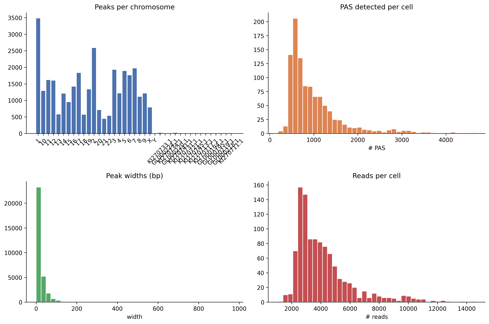
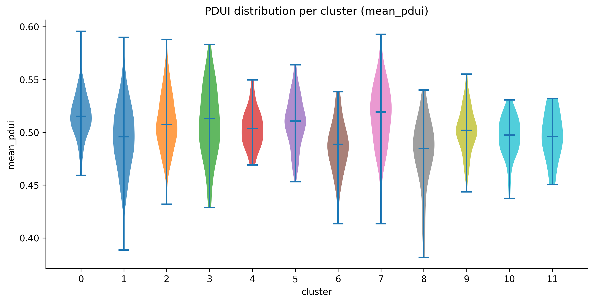

# Visualization strategies

Every figure in PeakATail is produced by a registered `VizStrategy` subclass.
Strategies are grouped by `plot_type` (what the figure shows) and tagged by
`engine` (matplotlib, plotly, or scanpy). Multiple engines can be rendered in
a single call via `render_all`.

Engines are selected at runtime with `--plot-engine matplotlib`, `plotly`,
`both`, or `none`. Matplotlib produces static PNG + SVG files. Plotly produces
interactive HTML files. Scanpy produces figures via its built-in plotting
functions.

Every figure has a companion `<stem>.meta.json` sidecar file. The sidecar
records the strategy name, generation timestamp, PeakATail version, and
plot-specific provenance keys. A `figures_INDEX.md` and `figures_INDEX.json`
manifest is written to the top of each `figures/` directory, grouping all
sidecars for human and machine consumption. See the
[Figure sidecar convention](#figure-sidecar-convention) section below.

---

## `umap` {#umap}

**Registered names:** `umap_matplotlib`, `umap_plotly`, `umap_scanpy`

**Data shape:** `(adata, ds_id)` — an AnnData with `obsm["X_umap"]` and
optionally `obs["leiden"]`, plus a dataset identifier string.

**What it shows:** A 2-D scatter plot of cells in UMAP space. Points are
colored by Leiden cluster label when `obs["leiden"]` is present; otherwise
rendered in a single color.

*Real output from the `full_v8` reference run — 12 leiden clusters.*

**When to interpret it:** After clustering, as a sanity check that clusters
are well-separated and biologically interpretable. Cells of the same cluster
should form spatially coherent regions. Scattered single-cell islands in the
middle of a large cluster usually indicate that `n_neighbors` is too low.

---

*Real output: 12 clusters ranging from 14 cells (cluster 11) to 210 cells (cluster 2).*

## `cluster_sizes` {#cluster_sizes}

**Registered names:** `cluster_sizes_matplotlib`, `cluster_sizes_plotly`

**Data shape:** `(adata, ds_id)` — AnnData with `obs["leiden"]` populated.

**What it shows:** A bar chart with one bar per cluster, annotated with the
exact cell count. Bars are sorted by natural cluster label order.

**When to interpret it:** Immediately after clustering. One dominant cluster
containing > 80% of cells combined with many tiny clusters (< 5 cells) is a
sign that `resolution` is too high or that `n_neighbors` is too large for the
dataset size.

---

## `peak_qc` {#peak_qc}

**Registered names:** `peak_qc_matplotlib`, `peak_qc_plotly`

**Data shape:** `dict` with keys:

| Key | Type | Content |
|---|---|---|
| `peaks_per_chrom` | `dict[str, int]` | Number of peaks per chromosome |
| `per_cell_pas` | `list[int]` | Number of PAS detected per cell |
| `peak_widths` | `list[int]` | Width in bp of each peak |
| `per_cell_reads` | `list[int]` | Total reads per cell |

**What it shows:** A 2x2 panel: (1) peaks per chromosome bar chart,
(2) histogram of PAS detected per cell, (3) histogram of peak widths in bp,
(4) histogram of reads per cell.

**When to interpret it:** Before clustering, to validate peak-calling quality.
A bimodal `per_cell_pas` distribution may indicate a doublet population. Very
wide peaks (> 500 bp) may indicate that `peackcalling` parameters need tighter
window constraints.

*Real output from the `full_v8` run — chromosomal coverage (top-left), PAS-per-cell
distribution (top-right), peak-width histogram (bottom-left), reads-per-cell
(bottom-right).*

---

## `volcano` {#volcano}

**Registered names:** `volcano_matplotlib`, `volcano_plotly`

**Data shape:** Either a `pd.DataFrame` with columns `["log2fc", "qvalue",
"pas_id"]` (legacy), or a `dict` with:

| Key | Type | Default | Description |
|---|---|---|---|
| `df` | DataFrame | required | Fisher or NB result with `log2fc`, `qvalue` columns |
| `fdr` | float | 0.05 | FDR threshold for the horizontal dashed line |
| `log2fc_thresh` | float | 1.0 | log2fc threshold for vertical dashed lines |
| `n_label` | int | 10 | Top-N points annotated with `gene_id` (if column present) |
| `cluster1`, `cluster2` | str | — | Included in figure title and meta sidecar |
| `strategy` | str | — | Test strategy name, included in title |
| `n_cells_cluster1`, `n_cells_cluster2` | int | — | Cell counts, included in title |

**What it shows:** A scatter of all tested PAS. X-axis: `log2fc` (positive =
higher in cluster 2). Y-axis: `-log10(qvalue)`. Horizontal dashed line at
`-log10(FDR)`. Vertical dashed lines at ±`log2fc_thresh`. Significant points
colored red (up in cluster 2) or blue (down in cluster 2).

**When to interpret it:** After `peakatail switch diff`. The upper-right quadrant
contains PAS used more in cluster 2; upper-left contains PAS used more in
cluster 1. Points near the horizontal line but inside the vertical lines have
significant but small effect size; approach with caution.

*Real output from `peakatail switch diff` on the `full_v8` run. Red dots = PAS used more
in cluster 4; blue dots = PAS used more in cluster 0. The top-N genes are
auto-labeled.*

---

## `pdui_distribution` {#pdui_distribution}

**Registered names:** `pdui_distribution_matplotlib`, `pdui_distribution_plotly`,
`pdui_distribution_scanpy`

**Data shape:** `(adata, score_key)` — AnnData with `obs["leiden"]` and
`obs[score_key]` populated with per-cell PDUI scores (float in [0, 1]).

**What it shows:** Per-cluster violin plots of the PDUI score. Each violin
shows the distribution of PDUI values across all cells in that cluster.
Medians are shown as horizontal lines.

**When to interpret it:** After running `peakatail switch length` with
`--strategy classic`. Clusters with PDUI median near 1.0 tend toward
longer 3' UTRs. Clusters with median near 0.0 tend toward shorter UTRs.
Bimodal violins within a cluster indicate heterogeneous PAS usage and may
warrant sub-clustering.

*Real output: per-cluster violins of `mean_pdui` across the 12 leiden clusters.*

---

## `proportion_heatmap` {#proportion_heatmap}

**Registered names:** `proportion_heatmap_matplotlib`, `proportion_heatmap_plotly`

**Data shape:** `dict` or `(pdui_df, adata)` tuple:

| Key | Type | Default | Description |
|---|---|---|---|
| `pdui_df` | DataFrame | required | Output of `proportion` strategy (long format) |
| `adata` | AnnData | required | AnnData with `obs["leiden"]` |
| `cluster_key` | str | `"leiden"` | Obs column for cluster labels |
| `top_n` | int | 50 | Number of most-variable PAS to display |

**What it shows:** A PAS x cluster heatmap. Rows are the top-N PAS by
cross-cluster variance (most discriminating). Columns are clusters. Cell
values are mean within-gene proportion across cells of that cluster.
Color scale: viridis (dark = 0, bright = 1).

**When to interpret it:** After `peakatail switch length --strategy proportion`.
A PAS with a bright cell in one cluster and dark in another is shifting its
within-gene proportion across conditions. Use this as a visual triage before
running `fisher` or `nb_pairwise`.

---

## `entropy_distribution` {#entropy_distribution}

**Registered names:** `entropy_distribution_matplotlib`,
`entropy_distribution_plotly`

**Data shape:** `(adata, score_key)` — AnnData with `obs["leiden"]` and
`obs[score_key]` holding per-cell Shannon entropy values.

**What it shows:** Per-cluster violin plots of Shannon entropy. Mirrors
`pdui_distribution` but for the entropy metric. Color scale uses viridis
rather than tab10.

**When to interpret it:** After `peakatail switch length --strategy shannon`.
Progenitor or cycling cell populations often show higher entropy (more uniform
PAS usage) than terminally differentiated cells. Clusters where the violin is
collapsed near 0 bits contain cells with highly focused PAS usage.

---

## `diff_agreement` {#diff_agreement}

**Registered names:** `diff_agreement_matplotlib`, `diff_agreement_plotly`

**Data shape:** `dict[str, set[str]]` mapping strategy name to the set of
significant PAS IDs declared by that strategy.

**What it shows:** A symmetric N x N heatmap where each cell [i, j] is the
Jaccard similarity between the significant PAS sets of strategy i and strategy
j. Diagonal = 1.0 (each strategy agrees with itself). Off-diagonal values
show pairwise strategy agreement. Annotated with numeric values.

**When to interpret it:** When running `peakatail switch diff` with multiple
`--strategy` values simultaneously. High Jaccard (> 0.7) between `fisher`
and `nb_pairwise` indicates the results are robust. Low Jaccard (< 0.3)
indicates the two tests are sensitive to different PAS or that one is
anti-conservative (Fisher) relative to the other.

Only rendered when at least 2 strategies are provided; returns empty list
otherwise.

---

## `length_shifts` {#length_shifts}

**Registered names:** `length_shifts_matplotlib`, `length_shifts_plotly`

**Data shape:** `pd.DataFrame` indexed by `gene_id` with one column per
cluster pair (e.g., `"0_vs_1"`, `"0_vs_2"`). Cell values are PDUI delta
(positive = lengthening in cluster 2, negative = shortening).

**What it shows:** A gene x cluster-pair heatmap using a red-blue diverging
colormap. Red = 3' UTR lengthening in cluster 2. Blue = shortening. Rows are
capped at the top 50 genes by maximum absolute delta to keep the figure
readable.

**When to interpret it:** As a summary view across multiple cluster pair
comparisons. Genes that shift across many pairs (multiple colored cells in a
row) are consistent APA regulators. Genes that shift only in one pair may
reflect cluster-specific biology or low-coverage noise.

---

## `pas_overlap` {#pas_overlap}

**Registered names:** `pas_overlap_matplotlib`, `pas_overlap_plotly`

**Data shape:** `dict[str, set[str]]` mapping dataset ID to the set of PAS
identifiers detected in that dataset.

**What it shows:** For 2 datasets: a 3-bar Venn-equivalent showing counts of
PAS unique to dataset A, shared by both, and unique to dataset B. For 3+
datasets: an UpSet plot (via the `upsetplot` library) showing intersection
sizes for all combinations.

**When to interpret it:** After merging multiple datasets to assess how much
of the PAS landscape is shared. A low overlap fraction (< 30% shared) suggests
that the datasets sample different parts of the transcriptome or that detection
sensitivity differs substantially between them.

---

## `atlas_snap_diag` {#atlas_snap_diag}

**Registered names:** `atlas_snap_diag_matplotlib`, `atlas_snap_diag_plotly`

**Data shape:** `dict` with keys:

| Key | Type | Description |
|---|---|---|
| `snapped` | int | Number of peaks that matched an atlas entry within the distance threshold |
| `unsnapped` | int | Number of peaks beyond the threshold |
| `snap_distances` | `list[int]` | Distance in bp for each snapped peak |

**What it shows:** A 2-panel figure. Left: bar chart of snapped vs. unsnapped
counts with percentage. Right: histogram of snap distances with the median
marked by a red dashed line.

**When to interpret it:** After atlas snapping in `peakatail run`. A high unsnapped
fraction (> 30%) may indicate that the snap distance threshold is too tight or
that the atlas does not cover the tissue type being analyzed. A median snap
distance > 50 bp suggests the atlas PAS are not well-calibrated to this
protocol's read 3'-end distribution.

---

## `cluster_match_sankey` {#cluster_match_sankey}

**Registered names:** `cluster_match_sankey_matplotlib`,
`cluster_match_sankey_plotly`

**Data shape:** `pd.DataFrame` from `ClusterMatchStrategy.match()` with
columns `dataset_id`, `original_cluster`, `canonical_cluster`,
`match_confidence`, `matched_to`.

**What it shows:** One stacked bar column per dataset. Each bar segment
represents one original cluster colored by its canonical cluster ID. Segment
opacity encodes `match_confidence` (opaque = high confidence). A legend maps
canonical cluster colors. Segment labels show `original → canonical` mapping.

**When to interpret it:** After `peakatail switch match`. A canonical cluster that
appears in all dataset columns with similar color means all datasets agree that
cell population exists. A canonical cluster appearing in only one dataset
column is a population unique to that sample.

---

## `match_confidence` {#match_confidence}

**Registered names:** `match_confidence_matplotlib`, `match_confidence_plotly`

**Data shape:** `pd.DataFrame` from `ClusterMatchStrategy.match()` (same as
`cluster_match_sankey`).

**What it shows:** A heatmap with rows labeled `{dataset}:{original_cluster}`
and columns labeled by canonical cluster ID. Cell value is `match_confidence`
(0 when no match). Color: YlOrRd (light yellow = 0, dark red = 1). Cells with
confidence > 0 are annotated with the numeric value.

**When to interpret it:** As a companion to `cluster_match_sankey` for
auditing specific cluster pairs. High off-diagonal values (a cluster matched
to two canonical IDs with similar confidence) indicate ambiguous assignment
and may warrant re-running with a different `n_top_markers` or switching from
`marker_overlap` to `mnn`.

---

## `tile_timing` {#tile_timing}

**Registered names:** `tile_timing_matplotlib`, `tile_timing_plotly`

**Data shape:** `list[dict]` — per-tile timing records with schema:

| Key | Type | Description |
|---|---|---|
| `dataset_id` | str | Dataset identifier |
| `chrom` | str | Chromosome name |
| `tile_idx` | int | Tile index within chromosome |
| `tile_start`, `tile_end` | int | Genomic coordinates |
| `wall_seconds` | float | Elapsed wall time for this tile |

**What it shows:** One subplot per dataset. Bar chart sorted descending by
`wall_seconds`. Tiles more than 2 standard deviations above the mean are
highlighted red (outliers).

**When to interpret it:** After `peakatail run` to diagnose performance. Outlier
tiles (red bars) on specific chromosomes often indicate high coverage regions
(e.g., mitochondrial chromosome, highly expressed ribosomal genes) that cause
clustering of reads and slow the peak-calling step. Use these to tune
`--threads` or tile size parameters.

---

## `resource_timeline` {#resource_timeline}

**Registered names:** `resource_timeline_matplotlib`, `resource_timeline_plotly`

**Data shape:** `dict` with keys:

| Key | Type | Description |
|---|---|---|
| `samples` | `list[dict]` | Periodic samples: `{"elapsed_s": float, "rss_gb": float, "cpu_pct": float}` |
| `annotations` | `list[dict]` | Stage markers: `{"label": str, "elapsed_s": float}` |

**What it shows:** A dual-axis line chart. Left y-axis: RSS in GB (blue line
with shaded fill). Right y-axis: CPU % (orange dashed line). Vertical grey
dotted lines mark pipeline stage transitions with rotated labels.

**When to interpret it:** After any `peakatail` run to understand memory and CPU
usage over time. A flat RSS line followed by a sudden spike indicates a step
that materializes a large array (e.g., the count matrix densification during
clustering). CPU dropping to near 0% between stage transitions indicates I/O-
bound steps or the GIL blocking parallelism.

---

## `gene_track` {#gene_track}

**Registered names:** `gene_track_matplotlib`, `gene_track_plotly`

**Data shape:** A `GenePanel` dataclass (from `ema.viz._gene_track_helpers`)
or `dict` with `"panel"` key and optional `"top_n_clusters"` (int, default 12):

`GenePanel` fields:

| Field | Type | Description |
|---|---|---|
| `gene_id` | str | Gene identifier |
| `chrom`, `start`, `end` | str, int, int | Genomic span |
| `strand` | str | `"+"` or `"-"` |
| `pas_ids` | `list[int]` | PAS identifiers in genomic order |
| `pas_positions` | `list[int]` | Genomic coordinate of each PAS |
| `clusters` | `list[str]` | Cluster labels in display order |
| `n_cells_per_cluster` | `list[int]` | Cell count per cluster |
| `reads` | `ndarray` (n_clusters, n_pas) | Total reads per PAS per cluster |
| `reads_per_cell` | `ndarray` (n_clusters, n_pas) | reads / n_cells_per_cluster |
| `proportions` | `ndarray` (n_clusters, n_pas) | Within-gene proportion (rows sum to ~1) |
| `isoforms` | `list[tuple[str, list[tuple[int, int]]]]` | Optional: (transcript_id, [(exon_start, exon_end), ...]) |

**What it shows:** A stacked subplot figure for one gene. When isoform data
is present, the top row shows exon bars per isoform with intron backbone lines
and strand arrows. Below it, one row per cluster shows vertical bars at each
PAS position. Bar height = reads/cell (depth-normalized). Bar color = within-
gene proportion on the viridis scale (dark = 0%, bright = 100%). Each bar is
annotated with the proportion percentage. A shared colorbar legend is added at
the right.

Up to `top_n_clusters` (default 12) clusters are rendered, prioritized by
total read count at the gene. The y-axis cap is the 95th percentile of
reads/cell across all rendered clusters, preventing one outlier PAS from
squashing the other bars.

**When to interpret it:** After `peakatail switch geneview` for a specific gene.
A gene with a dominant distal bar in one cluster and a dominant proximal bar
in another cluster is an APA candidate. The proportion annotation makes it
easy to see whether a visual shift in bar height is meaningful (e.g., 80% vs
20%) or marginal.

The figure title includes chromosome coordinates and strand. Use it to
cross-reference the gene structure with a genome browser.

---

## Figure sidecar convention {#figure-sidecar-convention}

Every figure written by `save_matplotlib` or the plotly equivalent is
accompanied by a `<stem>.meta.json` sidecar file at the same path. The sidecar
is written by `ema.viz._meta.write_figure_meta`.

**Fixed schema keys** (always present, never overwritten by the caller):

| Key | Description |
|---|---|
| `figure_name` | Filename stem of the figure |
| `viz_strategy` | Registered strategy name (e.g. `"umap_matplotlib"`) |
| `generated_at` | ISO 8601 UTC timestamp |
| `peakatail_version` | Version string from `importlib.metadata` |

**Plot-specific keys** are merged in by the strategy's `render` method and
vary by plot type (e.g., `n_cells`, `cluster_key`, `fdr`, `gene_id`).

**Manifest files** in each `figures/` directory:

- `figures_INDEX.json` — machine-readable list of all figure entries,
  each containing `stem`, `files` (sibling artefacts), and `meta` (sidecar
  content).
- `figures_INDEX.md` — human-readable summary grouped by plot type, with a
  concise tag line per figure. Written by `ema.viz._meta.write_figures_index`.

The manifest is regenerated after every command that produces figures. Read
`figures_INDEX.md` in any output directory to get an overview of what every
figure shows without opening the individual files.
