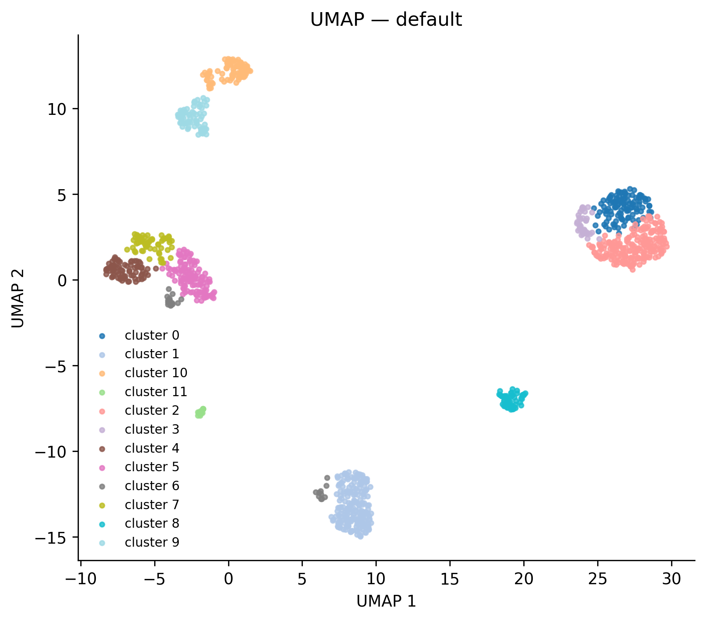
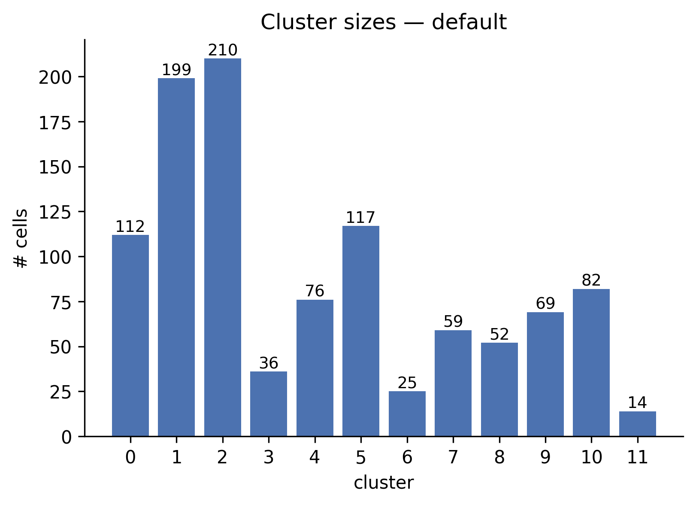
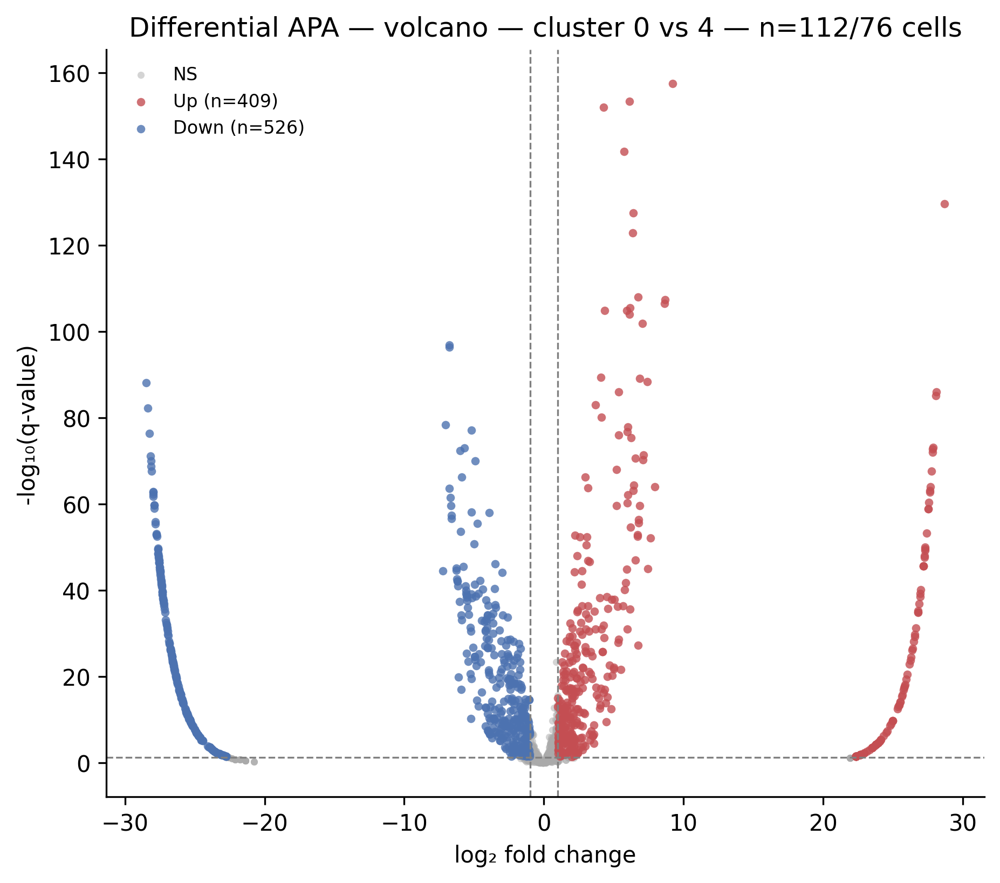

# Quickstart

This tutorial runs PeakATail end-to-end on a single BAM file. You will peak-call, cluster, run differential testing, and open the volcano figure — all in five steps.

---

## Step 1 — Configure `example.yaml`

Copy the file from the repo root and edit the paths:

```bash
cp example.yaml my_run.yaml
```

The full content of `example.yaml` with explanations for every key:

```yaml
# my_run.yaml
# Each dataset is one logical sample group. BAMs within a dataset share
# cell barcodes (same sequencing library — 10x, STARsolo, Alevin-fry, or
# any aligner emitting CB:Z / UB:Z tags). merge_strategy controls how
# multiple BAMs are combined before peak-calling (see Tutorial 3).
#
# merge_strategy options:
#   before  — merge all BAMs into one, then peak-call (more signal)
#   after   — peak-call each BAM separately, then merge PAS coordinates
#   none    — single BAM, no merging needed

datasets:
  - id: sample1
    merge_strategy: before
    bams:
      - /path/to/sample1_rep1.bam
      - /path/to/sample1_rep2.bam
  - id: sample2
    merge_strategy: none
    bams:
      - /path/to/sample2.bam

# GTF for gene annotation (Ensembl recommended)
gtf: /path/to/annotation.gtf

# Output directory (a timestamp suffix is added automatically)
output_dir: emaout

# Read geometry — match your sequencing protocol
seqlen: 150      # total read length
cb_len: 16       # cell barcode length: 10x v2/v3 = 16, Drop-seq = 12, etc.
barcode_tag: CB  # BAM tag holding the cell barcode

# Cell filtering
min_read: 1500   # minimum reads per cell barcode (low = too few PAS)
min_cells: 3     # minimum cells that must express a PAS to keep it
min_pas_per_cell: 50  # minimum PAS detected per cell (post-filter)
pas_gap: 100     # minimum bp gap between two PAS within one peak

# Optional: snap PAS to a reference atlas instead of calling de novo
# atlas: references/polyasite_2.0_GRCh38_sorted.bed
# atlas_distance: 50
```

Key field explanations pulled from `ema/cli/config_schema.py::RunConfig`:

| Key | Type | Default | What it does |
|-----|------|---------|--------------|
| `datasets` | list | — | One entry per sample group. Required. |
| `gtf` | path | — | Ensembl GTF for UTR annotation. Required. |
| `seqlen` | int | — | Sequencing read length. Required. |
| `cb_len` | int | — | Cell barcode length in bp. Required. |
| `barcode_tag` | str | `CB` | BAM tag holding the cell barcode. |
| `min_read` | int | `1500` | Drop cells with fewer total reads. |
| `min_cells` | int | `3` | Drop PAS expressed in fewer than this many cells. |
| `min_pas_per_cell` | int | `50` | Drop cells with fewer PAS detected (maps to `filter_config.min_genes`). |
| `pas_gap` | int | `100` | Minimum bp between two PAS calls within the same genomic peak. |
| `atlas` | path | `None` | When set, PAS are snapped to the reference atlas instead of de-novo coordinates. |
| `atlas_distance` | int | `50` | Maximum snap distance in bp. |

For a full list of parameters see `ema run --help` or the [CLI reference](../cli/index.md).

---

## Step 2 — Run the pipeline

```bash
uv run ema run --config my_run.yaml --threads 4
```

`--threads 4` limits the parallel worker pool to four CPUs. Omit it to let PeakATail auto-detect your machine's core count.

The run will print a progress bar with one stage per pipeline phase (peak calling, CB filter, GTF annotation, PAS-gene assignment, annotated matrix, preprocessing, clustering). Typical wall time on a single-BAM human sample (~100M reads, 1000 cells) is 15-30 minutes.

Output lands in a timestamped directory:

```
peakatail_runs/emaout_<timestamp>/
```

---

## Step 3 — Inspect what landed on disk

```bash
ls peakatail_runs/emaout_<timestamp>/per_dataset/sample1/
```

You will see:

```
annotated_cells.tsv      # cell barcode column index for the annotated matrix
annotated_matrix.mtx     # PAS-by-cell count matrix (post gene annotation, pre filter)
annotated_pas_ids.tsv    # PAS row index for the annotated matrix
annotatedpas.bed         # pasbed.bed extended with a gene_id column
clusters.h5ad            # AnnData with leiden cluster labels — the main output
filtered_cb.tsv          # cell barcodes that passed min_read filter
negbed.bed               # negative-strand PAS BED
pas_gene.tsv             # PAS-to-gene two-column mapping
pasbed.bed               # combined positive+negative PAS BED
posbed.bed               # positive-strand PAS BED
preprocessed.h5ad        # AnnData after cell/PAS filtering, before clustering
raw/                     # pre-filter snapshots: pos.bed, neg.bed, pas.bed, pos.mtx, neg.mtx, cb.tsv
```

The `clusters.h5ad` is the primary artifact for all downstream analysis. Load it with:

```python
import anndata as ad
adata = ad.read_h5ad("peakatail_runs/emaout_.../per_dataset/sample1/clusters.h5ad")
print(adata)
# AnnData object with n_obs x n_vars = <cells> x <PAS>
# obs: 'leiden', ...
# var: 'gene_id', ...
```


*UMAP coloured by Leiden cluster. Each dot is a cell. Clusters are computed from 3'UTR usage patterns, not total expression, so cells that use similar polyadenylation sites cluster together regardless of overall RNA levels.*


*Bar chart of cells per cluster. The largest clusters (1, 2, 5) contain 117-210 cells; the smallest (11) has 14 cells.*

---

## Step 4 — Run differential testing

Point `ema switch diff` at the h5ad produced above:

```bash
uv run ema switch diff \
  --h5ad peakatail_runs/emaout_<timestamp>/per_dataset/sample1/clusters.h5ad \
  --pasbed peakatail_runs/emaout_<timestamp>/per_dataset/sample1/pasbed.bed \
  --strategy fisher \
  --fdr 0.05
```

Output lands inside the same run directory:

```
peakatail_runs/emaout_<timestamp>/switch_diff_<timestamp>/
  differential/
    fisher_0_vs_1.tsv
    fisher_0_vs_2.tsv
    ...   (one TSV per cluster pair)
  markers.tsv               # top-N marker PAS per cluster used to filter tests
  figures/
    volcano_0_vs_1.png
    volcano_0_vs_1.html
    ...
    figures_INDEX.md        # human-readable index of all figures
    figures_INDEX.json      # machine-readable manifest
```

---

## Step 5 — Read the figures index

```bash
cat peakatail_runs/emaout_<timestamp>/switch_diff_<timestamp>/figures/figures_INDEX.md
```

This prints a table of every volcano figure with per-pair statistics. Example excerpt from the `full_v8` run:

```
## `volcano` (66)

- **volcano_0_vs_4** (2 files) — cluster 0 vs 4 · n_tested=1433 · sig=935
- **volcano_3_vs_4** (2 files) — cluster 3 vs 4 · n_tested=1364 · sig=1058
```

Open `volcano_0_vs_4.png` to see which PAS drive the separation:


*Each dot is a PAS. Red = higher usage in cluster 4 (positive log2fc); blue = higher usage in cluster 0 (negative log2fc). The dashed horizontal line marks q = 0.05; dashed vertical lines mark |log2fc| = 1. The 0 vs 4 comparison shows 935 significant PAS out of 1433 tested.*
