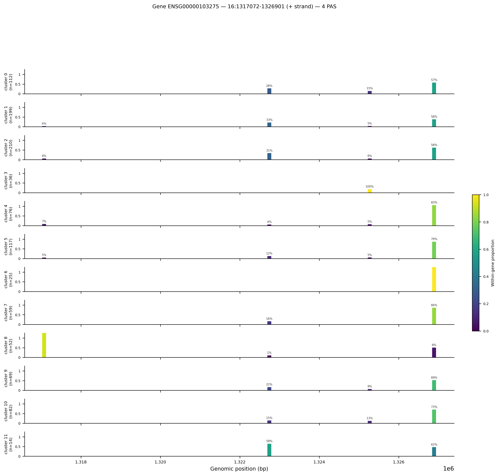

# Gene track deep dive

`ema switch geneview` generates a single-page summary for one or more genes, showing where PAS fall along the gene body and how each cluster uses them. Use it after `ema switch diff` to turn a list of significant PAS IDs into a visual you can put in a presentation or paper.

---

## When to use geneview

Use geneview when you want to:

- Confirm that a significant differential PAS from the Fisher TSV maps to the expected 3' end region.
- Compare PAS usage across all clusters simultaneously in one figure.
- Show a reviewer that the signal is real and not an artifact of a single cluster.

Do not use geneview as the first analysis step. Run `ema switch diff` first to identify which genes carry significant differential PAS, then call geneview on the top hits.

---

## Minimal invocation

```bash
uv run ema switch geneview \
  --diff-tsv peakatail_runs/full_v8_2026-05-11_152746/switch_diff_2026-05-11_205015/differential/fisher_0_vs_4.tsv \
  --pasbed peakatail_runs/full_v8_2026-05-11_152746/per_dataset/only/pasbed.bed \
  --h5ad peakatail_runs/full_v8_2026-05-11_152746/per_dataset/only/clusters.h5ad \
  --top-genes 5
```

`--diff-tsv` accepts the per-pair Fisher TSV from `ema switch diff`. `--top-genes 5` auto-selects the five genes with the strongest aggregate signal (ranked by sum of |log2fc| × −log₁₀(q) across all significant PAS for that gene). `--pasbed` provides the coordinate map from PAS ID integers to genomic positions. `--h5ad` is the clustered AnnData.

Output lands in:

```
peakatail_runs/full_v8_2026-05-11_152746/switch_geneview_<timestamp>/
  figures/
    gene_ENSG00000103275.png
    gene_ENSG00000103275.svg
    gene_ENSG00000103275.meta.json
    gene_ENSG00000100600.png
    ...
    figures_INDEX.md
    figures_INDEX.json
```

---

## Invocation with GTF for isoform structure

Add `--gtf` to annotate known transcript boundaries in the gene body panel:

```bash
uv run ema switch geneview \
  --diff-tsv peakatail_runs/full_v8_2026-05-11_152746/switch_diff_2026-05-11_205015/differential/fisher_0_vs_4.tsv \
  --pasbed peakatail_runs/full_v8_2026-05-11_152746/per_dataset/only/pasbed.bed \
  --h5ad peakatail_runs/full_v8_2026-05-11_152746/per_dataset/only/clusters.h5ad \
  --gtf /path/to/Homo_sapiens.GRCh38.99.gtf \
  --top-genes 5
```

Without `--gtf` the gene body panel shows only the gene locus extent (start to end), not individual transcript models. With `--gtf` exon blocks are drawn where the reference annotation has them, making it easy to see whether a PAS falls inside the annotated 3'UTR or downstream of the last exon.

---

## Specifying explicit gene IDs

Use `--gene-id` to override auto-selection or add specific genes:

```bash
uv run ema switch geneview \
  --diff-tsv .../fisher_0_vs_4.tsv \
  --pasbed .../pasbed.bed \
  --h5ad .../clusters.h5ad \
  --gene-id ENSG00000103275 \
  --gene-id ENSG00000100600 \
  --top-genes 0
```

`--top-genes 0` disables auto-selection so only the explicitly listed genes are rendered. Combine `--gene-id` and `--top-genes N` to get both the auto-selected top N and any genes you add manually.

---

## Reading the figure

Here is the gene track figure for ENSG00000103275 (chr16:1317072-1326901, positive strand) produced from the `full_v8` run:


*Gene track for ENSG00000103275 on chromosome 16 (+ strand). The x-axis is genomic position in bp. Each row is one Leiden cluster (labelled with cluster number and cell count). The y-axis within each row is normalised reads per cell. Colour encodes within-gene proportion: yellow = this PAS carries most of the gene's reads in that cluster, dark blue = low proportion.*

**Panel layout:**

- Each horizontal strip is one cluster, ordered cluster 0 at top through cluster 11 at bottom.
- The cell count for that cluster appears in the label on the left (e.g. `cluster 0 (n=112)`).
- Each vertical bar at a genomic coordinate is a PAS. Bar height is the mean reads per cell at that PAS, normalised so the tallest bar in the panel reaches 1.0.
- Colour encodes the within-gene proportion: the fraction of that gene's total reads in that cluster that come from this specific PAS. Yellow (proportion = 1.0) means all the gene's reads go through this one PAS. Dark blue (proportion near 0) means this PAS contributes little relative to other PAS of the same gene.
- The percentage annotation above each bar is the within-gene proportion rounded to the nearest integer.

**Reading this specific figure:**

- PAS at ~1326800 (rightmost, distal PAS) dominates most clusters (57–94% of reads). This is the canonical distal polyadenylation site for this gene on the positive strand.
- Cluster 8 is strikingly different: the leftmost PAS at ~1317100 (proximal, closest to the stop codon) carries most of cluster 8's reads (yellow bar). This cluster uses the short 3'UTR isoform almost exclusively.
- Cluster 11 splits roughly 50/50 between the central PAS at ~1322400 and the distal PAS, suggesting heterogeneous isoform usage within this small cluster (n=14 cells).

The `.meta.json` sidecar confirms the rendering parameters:

```json
{
  "gene_id": "ENSG00000103275",
  "chrom": "16",
  "start": 1317072,
  "end": 1326901,
  "strand": "+",
  "n_pas": 4,
  "n_clusters_rendered": 12,
  "top_proportion_per_cluster": {
    "0": 0.57,
    "3": 1.0,
    "8": 0.93,
    ...
  }
}
```

---

## Figures index

The auto-generated `figures_INDEX.md` lists every gene rendered in a geneview run:

```markdown
# Figures index

Produced by `ema switch geneview`.

Directory: .../switch_geneview_2026-05-11_212341/figures

Total figures: 5 across 1 plot type(s).

## `gene_track` (5)

- **gene_ENSG00000100600** (2 files)
- **gene_ENSG00000103275** (2 files)
- **gene_ENSG00000105939** (2 files)
- **gene_ENSG00000160087** (2 files)
- **gene_ENSG00000168899** (2 files)
```

Each entry has a `.png` (for documents) and a `.svg` (for scalable embedding). The `figures_INDEX.json` provides the same information in machine-readable form for programmatic access.
