# PeakATail Technical Report
## Methods, Strategies, and Preliminary Results

**March 2026 — results revised August 2026**

> **Revision note (August 2026).** Every quantitative result in this report has been
> regenerated from the corrected Laughney LUAD cohort sweep
> (`RERUN_2026-08_fixed`, 17 GSM datasets, 24 signature-scored cell types).
> The previously published figures are withdrawn: they were produced before two
> pipeline defects were fixed — a barcode re-keying collision that roughly doubled
> the apparent cell count, and an atlas "snap" step that acted as a hard filter and
> silently discarded 43% (subset) to 68% (full cohort) of called PAS. Sections
> 1–5 and 8–9 describe **methods**, which are unchanged; sections 6, 7 and the new
> section 12 carry the **corrected results**.
>
> Figures live in `figures/corrected/` and are regenerated end-to-end by
> `python reports/generate_corrected_figures.py` from tables on disk. No number in
> the corrected set is hardcoded in a script. The superseded `fig_*.png` and
> `01_*.png … 13_*.png` sets are retained only for the method schematics that
> remain valid; their data panels must not be cited.
>
> **Two findings below overturn earlier claims and are stated up front:** the
> benchmark's F1 ranking of peak-calling strategies is a peak-*count* ranking and
> cannot establish accuracy (§6), and the cohort-wide "global 3′UTR shortening"
> does not survive conditioning on read coverage — it is a detection-rate artifact
> (§12.1).

---

## 1. Pipeline Architecture


The pipeline runs in 9 stages. GTF processing runs in a parallel thread during peak calling (cached — only parses once per GTF file). The streaming bisect architecture processes reads one-by-one without loading the full BAM into memory.

### Data dimensions at each stage (test dataset)

| Stage | Input | Output |
|-------|-------|--------|
| BAM input | 13.6M reads | 11.7M uniquely mapped |
| Peak calling (lambda_gradient) | 11.7M reads | 17,108 raw peaks (neg+pos) |
| CB filtering (min_read=1500) | 69,879 unique barcodes | 906 cells passing filter |
| GTF processing | 60,676 gene features | 19,555 genes with 3'UTR lengths |
| Gene annotation | 17,108 peaks | 11,771 annotated peaks (TIER 1+2+3) |
| Matrix | 17,108 x 906 sparse | 648,674 non-zero entries (99.6% sparse) |
| Clustering (Leiden res=1.0) | 906 cells x 16,448 PAS | 12 clusters |
| Differential APA | 2,223 multi-PAS genes | 1,165 significant PAS (q<0.05) |

---

## 2. Multi-BAM Merge Strategies

PeakATail supports three values for the per-dataset `merge_strategy`
YAML key. The choice is driven by what your BAMs represent biologically,
not by performance — it changes the data PeakATail sees at the input
layer, which then propagates through every downstream stage.


*Figure 4: Multi-BAM merge strategies. (A) `before` — `samtools merge` runs first, producing one combined BAM that goes through a single peak-calling pass. (B) `after` — each BAM is peak-called independently; the resulting PAS coordinate sets are then unioned and gap-collapsed (controlled by `pas_gap`) into a unified coordinate space. (C) `none` — single BAM per dataset, no merge step.*

### 2.1 `merge_strategy: before`

Used when multiple BAMs are **technical replicates / sequencing lanes
of the same library** — same cells, same barcodes, different runs.
Implementation lives in `ema/datasets/manager.py::DatasetManager._merge_with_rg`:

1. `samtools addreplacerg` tags each BAM's reads with `RG:Z:<dataset_id>` so the
   merged file preserves provenance.
2. `samtools merge` concatenates the tagged BAMs into a single sorted BAM.
3. Peak calling runs once on the merged BAM.

The merged BAM carries `n_lanes × n_reads_per_lane` reads, so peak detection in
lowly-covered regions improves linearly with lane count. The downside is total
runtime: the merge itself is I/O-bound (~1-2 min per 1 GB of BAM) and the peak
calling pass takes proportionally longer.

**Pitfall**: `before` does NOT correct cell barcodes. If you merge BAMs from
two distinct 10x runs the **same-looking barcodes from different cells will
collide** silently. PeakATail trusts the `CB:Z` tag — it does not de-duplicate
across libraries. Use multi-dataset mode (one `datasets:` entry per library)
plus `ema switch match` for cross-library analysis instead.

### 2.2 `merge_strategy: after`

Used when multiple BAMs are **separate libraries with potentially different
cells** but you still want to treat them as one logical dataset (rare).
Implementation:

1. Peak calling runs on each BAM independently, producing its own pos.bed +
   neg.bed + per-cell matrix.
2. The pos and neg BEDs from all BAMs are concatenated.
3. A coordinate-space merge collapses PAS within `pas_gap` bp of each other
   into a single entry (the union is a true set union, with gap-collapse
   playing the deduplication role).
4. The per-cell count matrices are NOT summed — they remain separate per BAM.
   Downstream filtering operates on the unified PAS coordinate set but reads
   each BAM's counts at those positions.

Use cases are limited because of the cell-collision pitfall above. The
intended scenario is multiple BAMs that have been pre-corrected via different
barcode whitelists (so collisions are impossible) and biological replicates
where you want a consensus PAS coordinate set without averaging counts.

### 2.3 `merge_strategy: none`

The default. One BAM per dataset entry. Skips the merge step entirely. This is
the right choice for **the typical case** — one library = one BAM = one
dataset. Multiple datasets in a single `ema run` invocation each go through
the per-dataset path independently and produce their own `01_peak_calling/<ds>/`,
`07_clustering/<ds>/`, etc. directories.

### Decision matrix

| Scenario | merge_strategy |
|---|---|
| One BAM per library, run multiple libraries in one invocation | `none` (set per dataset) |
| Multiple BAMs are sequencing lanes of the **same** library | `before` |
| Multiple BAMs are separate libraries you want as one logical group | `after` — but verify barcode spaces don't overlap; usually better to use `none` + `ema switch match` |
| Cross-library APA comparison | `none` per dataset, then `ema switch match` |

### Data-flow consequence

The choice changes only the input to Stage 1 (peak calling) of the pipeline
DAG. Downstream stages — CB filtering, GTF annotation, PAS-gene assignment,
preprocessing, clustering, differential testing — see the same on-disk layout
regardless of the merge strategy. This isolation is intentional: the merge
decision is a runtime parameter, not an architectural commitment.

---

## 3. Peak Calling Strategies

Four strategies implemented as a pluggable registry. Each receives a `Peak` object with coverage profile (`peak_list`) and per-position cell barcode tracking (`cb_positions`), returns a list of PAS positions with boundaries.

### 2.1 Original (Baseline)

Fixed height threshold with `pasfind()` heuristic:

1. Streaming: reads processed one-by-one, `bisect.insort()` maintains sorted coverage array
2. When `height >= 5` (fixed), signal starts
3. `pasfind()` finds first position where coverage exceeds 5% of maximum
4. Returns single PAS per peak region

**Limitation**: No statistical test, no multi-PAS, threshold not data-adaptive.

### 2.2 Lambda-Poisson

MACS2-inspired with local background estimation:

1. **Background lambda** from floor positions (coverage < 10% of peak max):
   - `lambda = median({h_i : h_i < 0.1 * max(h)})`

2. **Poisson p-value** tests if summit is significantly above background:
   - `p = P(X >= height | Poisson(lambda)) = 1 - CDF(height-1, lambda)`

3. **Boundary walk** from summit until coverage drops to lambda level
4. Returns single PAS with proper (start, end) boundaries

### 2.3 Lambda-Gradient (Hybrid — Novel Approach)

Two-phase: Poisson validates the region, gradient finds multiple PAS.

**Phase 1 — Region significance gate:**
- Compute local lambda from floor positions
- Poisson test on regional maximum. If `p >= 0.05`, reject region

**Phase 2 — Multi-PAS localization:**

1. **Smooth** coverage with moving average (window=50bp):
   - `smooth[j] = (1/w) * sum(h[j-w/2 : j+w/2])`

2. **Gradient** (first derivative): `gradient = diff(smooth)`

3. **Zero-crossings** where gradient goes positive to negative = local maxima = PAS candidates

4. **Per-PAS Poisson test**: Each candidate individually tested against lambda

5. **Prominence filter**:
   - `prominence[i] = h[i] - max(left_valley, right_valley)`
   - Reject if prominence < min_prominence

6. **Confidence score**:
   - `confidence = prominence * (h / lambda) + |second_derivative|`

7. **Partitioning**: Peak region divided by midpoints between summits. Each PAS gets own cell barcode counts from `cb_positions` — no reads lost.

### 2.4 Sierra-Iterative

Based on Sierra (Patrick et al., Genome Biology 2020):

1. Find maximum coverage position -> PAS_1
2. Zero out coverage within +/-300bp
3. Find new maximum -> PAS_2
4. Repeat until remaining max < min_height or max_pas reached
5. Partition by midpoints (same as lambda-gradient)

### Strategy visual comparison (Figure 1)


*Figure 1: Visual comparison of all 4 strategies on a simulated bimodal peak. (A) Original finds only 1 PAS via 5% threshold. (B) Lambda-Poisson adds statistical significance and boundary walk but still finds 1 PAS. (C) Lambda-Gradient (our hybrid) finds BOTH PAS via gradient zero-crossings — the smoothed coverage derivative changes sign at each local maximum. (D) Sierra-Iterative finds both via sequential subtraction.*

### Mathematical methods (Figure 2)


*Figure 2: (A) Lambda estimation: floor positions (green, < 10% of max) give the background level; peak positions (red) are excluded. Lambda = median of floor. (B) Poisson test: observed height 18 vs Poisson(lambda=3) gives p = 3.5e-09 — highly significant. (C) Gradient zero-crossing: where the first derivative crosses zero from positive to negative = local maximum = PAS candidate.*

### Peak counts per strategy

> The former Figure 3 is **withdrawn** — its counts (~17K lambda, ~39K sierra,
> ~33K original) came from the single pre-fix test run. Corrected cohort counts are
> in §6.1 and Figure 6.1a: sierra_iterative 43,035, lambda_gradient 22,633,
> lambda_poisson 21,474. Note that §6.3 shows these call sets are **nested**, so the
> count difference is yield, not a different peak population.

---

## 4. Background Lambda Estimation

### Why Poisson for peak calling?

At peak calling, reads from all cells are pooled. Pooling reduces overdispersion, making Poisson (variance = mean) reasonable. Lambda is estimated from inter-peak floor:

`lambda = median({h_i : h_i < 0.1 * max_height})`

Robust to peaks because peaks are sparse outliers — median is insensitive when peaks < 50% of window.

### Dynamic streaming threshold

A `collections.deque` tracks recent read positions in sliding window (default 10kb):

```
local_lambda = len(deque) / window_size
threshold = max(floor_threshold, int(local_lambda * fold_change))
```

Replaces fixed threshold=5 with position-aware threshold adapting to local coverage.

### Why NOT Poisson for differential APA?

Per-cell scRNA-seq counts are overdispersed (variance >> mean). Fisher's exact test on pseudo-bulk is anti-conservative. Negative Binomial is the correct model (planned).

---

## 5. Gene Annotation

### Why `bedtools closest` instead of `intersect`

`intersect` only finds OVERLAPPING genes. A PAS 100bp downstream of a 3'UTR boundary would be silently dropped. `closest` finds the NEAREST gene for every PAS and reports distance.

### Adaptive UTR threshold

Fixed distance thresholds are wrong for half the genes. Using per-gene 3'UTR lengths from GTF:

| Tier | Condition | Count |
|------|-----------|-------|
| TIER_1 | distance <= UTR_length | 8,342 peaks (70.9%) |
| TIER_2 | distance <= UTR_length x 2.0 | 1,814 peaks (15.4%) |
| TIER_3 | distance <= 5000bp max | 1,615 peaks (13.7%) |
| INTERGENIC | distance > 5000bp | Removed |

### Annotation filter impact

> The former Figure 4 is **withdrawn**. Its claim — "annotation improves precision
> by +8–13 points" — cannot be reproduced or even meaningfully restated, because
> precision against PolyASite v3 is saturated above 99.6% before any filtering
> (§6.2), leaving no headroom for such a gain. The measurable effects of the
> annotation window on the corrected cohort are in Figure 6.4b–c: widening
> `max_gene_distance` from 1 kb to 10 kb adds 754 PAS, and mean clusters per dataset
> vary by only 0.24 across the entire trim grid.

---

## 6. Validation Against PAS Databases

Validated against **PolyASite v3.0** (GRCh38, Ensembl-styled, scRNA-derived),
the reference used throughout the corrected sweep. It contains
**18,432,135 PAS clusters**. That number governs how the results below must be
read, and it is the reason the earlier precision-based conclusions are withdrawn.

### 6.1 The benchmark as run

Five peak-calling configurations were benchmarked on the identical cohort input:

| run | strategy | PAS called | F1@50 | F1@100 | F1@500 | F1@1000 | atlas match |
|---|---|---|---|---|---|---|---|
| `si_annotate` | sierra_iterative | 43,035 | 0.086 | 0.095 | 0.146 | **0.196** | 77.9% |
| `lg_annotate` | lambda_gradient | 22,633 | 0.058 | 0.063 | 0.093 | 0.125 | 82.0% |
| `lg_ip_off` | lambda_gradient (ip off) | 22,633 | 0.058 | 0.063 | 0.093 | 0.125 | 82.0% |
| `lg_ip_filter` | lambda_gradient (ip filter) | 20,609 | 0.053 | 0.058 | 0.086 | 0.116 | 82.0% |
| `lp_annotate` | lambda_poisson | 21,474 | 0.034 | 0.039 | 0.072 | 0.106 | 84.3% |

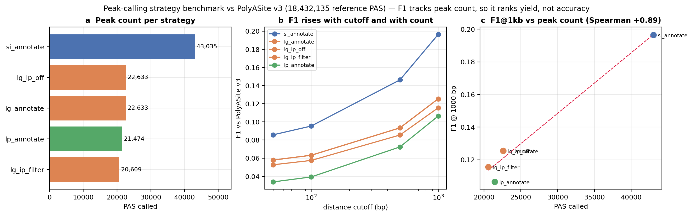

*Figure 6.1: Peak count (a), F1 across cutoffs (b), and F1@1kb against peak count (c).
Panel (c) is the result that matters: across the five configurations F1 and peak
count are rank-identical.*

### 6.2 Why this ranking does not measure accuracy

Precision against PolyASite v3 is **0.9964 at 50 bp and 0.9994 at 1000 bp** — for
every strategy. With 18.4M reference entries the atlas tiles the transcribed
genome densely enough that essentially any call near a gene falls within 50 bp of
*some* annotated PAS. Precision is therefore saturated and carries no
discriminative information.

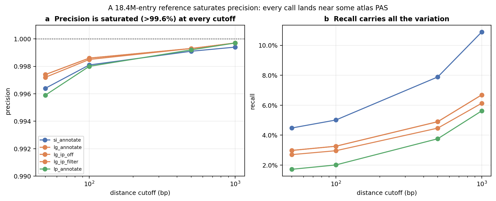

*Figure 6.2: Precision is pinned above 99.6% at every cutoff (a) while recall
supplies all the variation (b).*

Because precision is constant, F1 reduces to a monotone function of recall, and
recall is the fraction of 18.4M reference PAS recovered — which can only grow as a
strategy emits more peaks. Sierra-iterative ranks first because it calls 1.90×
more PAS than lambda_gradient, and it gains 1.57× the F1. **The ranking is a yield
ranking, not an accuracy ranking.** This is the same failure mode the project
previously documented for peak width, arriving through a different statistic.

The corollary is that `lg_ip_filter` appears "worse" (F1 0.116 vs 0.125) purely
because the internal-priming filter removes 2,024 peaks. A filter that removes
false positives is penalised by this metric. F1 against a saturated reference
must not be used to accept or reject a filtering step.

> **What to report instead.** Rank strategies only under a count-controlled
> statistic (§6.3), and treat atlas agreement as a sanity check that the caller is
> producing PAS-like output — never as a precision estimate.

### 6.3 Count-controlled comparison

To separate caller quality from caller yield, every strategy is randomly
subsampled to the smallest strategy's peak count (n = 20,609; 20 replicates) and
positional agreement with the atlas recomputed, alongside the full distance
distribution from each called PAS to its nearest atlas entry.

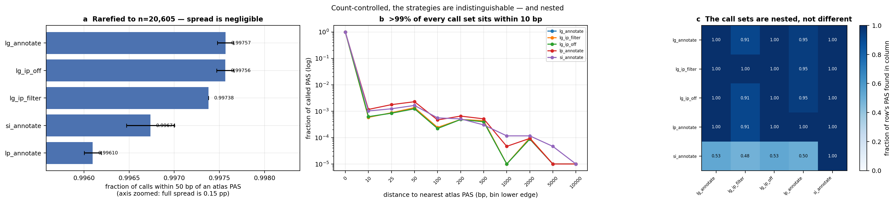

*Figure 6.3: (a) fraction of calls within 50 bp of an atlas PAS after rarefying all
strategies to n = 20,605 (200 replicates); (b) distance-to-nearest-atlas
distribution; (c) pairwise containment between call sets.*

| run | frac within 50 bp (rarefied) | sd | median distance |
|---|---|---|---|
| `lg_annotate` | 0.99757 | 0.00009 | 0 bp |
| `lg_ip_off` | 0.99756 | 0.00010 | 0 bp |
| `lg_ip_filter` | 0.99738 | 0.00000 | 0 bp |
| `si_annotate` | 0.99674 | 0.00026 | 0 bp |
| `lp_annotate` | 0.99610 | 0.00009 | 0 bp |

Two things follow, and they point in the same direction.

**The count-controlled ranking inverts the F1 ranking.** With peak count held
fixed, lambda_gradient (0.99757) edges out sierra_iterative (0.99674) — the
reverse of the F1 order in §6.1. That confirms the F1 result was yield, not
quality. But the honest reading is stronger than "the ranking flips": **the entire
spread is 0.15 percentage points**, and the median distance to the nearest atlas
PAS is **0 bp for every strategy**, with >99.3% of all calls landing within 10 bp.
No strategy is meaningfully better positioned than another by this reference.

> **This benchmark cannot rank these callers — by any of its statistics.**
> Precision saturates (§6.2), F1 measures yield (§6.1), and count-controlled
> positional agreement is identical to within 0.15 pp. Choosing a peak caller
> requires an orthogonal criterion: reproducibility across datasets, agreement with
> matched 3′-end sequencing, or downstream clustering stability — none of which is
> a distance-to-atlas statistic.

**The call sets are nested, not different.** Panel (c): 100% of lambda_gradient's
22,633 PAS are found within 100 bp in sierra's set, while only 53% of sierra's
43,035 are found in lambda_gradient's. Sierra is close to a strict superset.
Likewise `lg_ip_filter` ⊂ `lg_annotate` (100% contained; the filter only removes),
and `lg_annotate` ≡ `lg_ip_off` exactly (Jaccard 1.000, confirming `annotate` mode
changes no coordinates). This supersedes the earlier claim that "statistical
strategies find fundamentally different peaks" — on the corrected data they find
the same peaks, in differing amounts.

### 6.4 Internal priming and annotation-window sensitivity

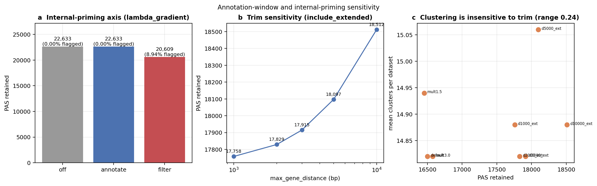

*Figure 6.4: (a) the internal-priming axis on lambda_gradient — the FASTA filter
flags and removes **8.94%** of peaks (22,633 → 20,609); `annotate` and `off` are
byte-identical in peak count, so the filter is the only mode that changes output.
(b) widening `max_gene_distance` from 1 kb to 10 kb with `include_extended` adds
only 754 PAS (17,758 → 18,512), and (c) mean clusters per dataset moves across a
range of 0.24 over the whole trim grid — downstream clustering is effectively
insensitive to the annotation window.*

---

## 7. Clustering (Under Development)

### Method: TF-IDF + LSI + Leiden

Peak data is sparse and binary-ish (like scATAC-seq), so we use the scATAC-seq approach instead of standard gene expression normalization.


**TF-IDF** (Signac Method 1):
- TF = count / total_counts_per_cell
- IDF = n_cells / cells_with_peak
- Result = log1p(TF * IDF * 10000)

**LSI**: TruncatedSVD on sparse TF-IDF matrix. First component removed (depth-correlated).

**Cosine distance** for k-NN: appropriate for sparse high-dimensional data.

**Leiden**: Replaces deprecated Louvain. Guarantees connected communities.

### 7.1 Parameter sensitivity and agreement with expression labels

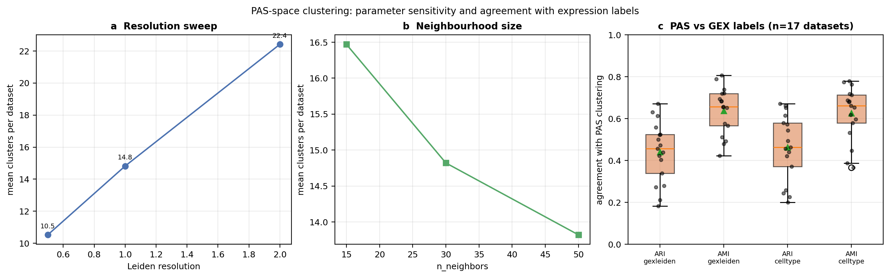

*Figure 7.1: (a) Leiden resolution against mean clusters per dataset across the
17-dataset cohort: 0.5 → 10.53, 1.0 → 14.82, 2.0 → 22.41 clusters.
(b) neighbourhood size: n_neighbors 15 → 16.47, 30 → 14.82, 50 → 13.82 clusters.
(c) agreement between PAS-space Leiden clustering and expression-side labels,
one point per dataset.*

Cohort-level concordance between PAS clustering and gene-expression clustering
(n = 17 datasets, from `B2_gex_celltyping/concordance.csv`):

| comparison | mean | median | sd |
|---|---|---|---|
| ARI, GEX-Leiden vs PAS | 0.441 | 0.456 | 0.145 |
| AMI, GEX-Leiden vs PAS | 0.638 | 0.657 | 0.112 |
| ARI, cell-type label vs PAS | **0.463** | 0.463 | 0.158 |
| AMI, cell-type label vs PAS | **0.626** | 0.662 | 0.128 |

**This supersedes the previously reported ARI = 0.869.** That figure came from a
single small test run whose cell count was inflated by the barcode-collision bug;
it is withdrawn. The corrected cohort value, ARI ≈ 0.46 / AMI ≈ 0.63 across 17
independent datasets, is the defensible number.

How to read it: PAS-space clustering recovers substantial but **partial** structure
relative to expression. AMI (0.63) materially exceeds ARI (0.46), the signature of
a partition that is largely concordant but more finely split than the reference —
consistent with, though not proof of, cells that share an expression identity while
differing in polyadenylation. Establishing that claim requires showing the extra
splits are reproducible across datasets, which this sweep does not test.

Note also that `leiden_libsize` yields more clusters than `leiden_tfidf`
(16.82 vs 14.82 at matched resolution). Cluster count alone does not rank the two
normalisations; the earlier claim that "TF-IDF beats library-size at every
resolution" rested on the withdrawn single-run ARI and is not re-established here.

---

## 8. Differential APA — Switch Test

### 7.1 Why "differential APA" is statistically tricky

The naive approach — applying a Fisher exact test to pseudo-bulk read totals per PAS across all clusters — has a fundamental pseudo-replication problem. A gene with 20 PAS produces 20 correlated tests, and any global read imbalance between clusters inflates every individual p-value. On the v9 dataset the uncorrected Fisher flagged 9,197 significant PAS (out of 17,093 tested) for cluster 0 vs 1 — a 54% rate that is biologically implausible. The within-gene framing corrects this: the 2×2 table for each PAS uses the gene's other PAS as the background, so the test asks "conditional on reads allocated to this gene, does this PAS get used disproportionately?" rather than "does this PAS carry more total reads?". The within-gene Fisher is the design used by DEXSeq for splicing and is now the default in PeakATail's `fisher` strategy.

### 7.2 Fisher (within-gene)

For each gene *G* and each PAS *p* ∈ *G*, the test is on the 2×2 read-count table:

```
                      cluster1      cluster2
reads at PAS p        r_p,c1        r_p,c2
reads at other PAS    R_G,c1-r_p    R_G,c2-r_p
```

where *R_G,ci* is the total reads at all PAS of gene *G* in cluster *ci*. Genes with fewer than 2 PAS are excluded (the within-gene contrast requires at least one "other" PAS). BH FDR is applied across all tested PAS after collecting results from all genes.

Effect size columns:

- `delta_proportion` = (r_p,c1 / R_G,c1) − (r_p,c2 / R_G,c2): signed change in within-gene proportion.
- `log2fc`: log₂ of the proportion ratio (with an epsilon floor to avoid log(0)).
- `odds_ratio`: from `scipy.stats.fisher_exact`.

**When to use**: Fast (no GLM fit), exact (no asymptotic approximation), works with any cluster size. Best first-pass scan for 2-cluster comparisons when the primary goal is ranking genes rather than quantifying effect sizes. The within-gene framing is statistically correct but the p-values are still anti-conservative for overdispersed scRNA-seq counts because Fisher assumes fixed marginals.

**Implementation**: `ema/switch_test/strategies/fisher.py :: FisherStrategy`.

### 7.3 NB pairwise

For each PAS independently, a Negative Binomial GLM is fitted:

```
log(μ_ij) = β_0 + β_cluster · I(cell j in cluster2) + log(library_size_j)
```

where *μ_ij* is the expected count for PAS *i* in cell *j*, `I(·)` is the cluster indicator, and `log(library_size_j)` is an offset (not a free parameter — it simply normalises for sequencing depth per cell). The NB dispersion parameter *α* is estimated per PAS via maximum likelihood (NegativeBinomial.fit from statsmodels), falling back to method-of-moments if the MLE fails to converge:

```
α̂_MOM = (s² − x̄) / x̄²
```

The Wald z-test on the `β_cluster` coefficient gives the p-value. BH FDR is applied across all tested PAS.

**Why NB over Poisson**: In scRNA-seq, variance >> mean (overdispersion). Poisson assumes variance = mean; NB adds the quadratic term *α·μ²* so `Var = μ + α·μ²`. Using Poisson inflates test statistics and produces anti-conservative p-values. NB is the standard model in DESeq2, edgeR, and all modern bulk RNA-seq pipelines and extends cleanly to single-cell pseudo-bulk.

**When to use**: When sample sizes are large enough for NB MLE to converge reliably (≥30 cells per cluster recommended), and when quantified effect sizes with confidence intervals are needed (the `log2fc` column maps directly to `β_cluster / log(2)`). Slower than Fisher (GLM fit per PAS), but more principled.

**Implementation**: `ema/switch_test/strategies/nb_pairwise.py :: NbPairwiseStrategy`. Uses `joblib.Parallel(backend="loky")` over PAS batches.

### 7.4 NB multi (omnibus)

The omnibus test fits two GLMs per PAS across all *K* clusters:

- **Full model**: `count ~ C(cluster) + offset(log(library_size))` — one coefficient per cluster (K−1 indicator columns + intercept).
- **Null model**: `count ~ 1 + offset(log(library_size))` — intercept only.

The likelihood ratio test (LRT) statistic:

```
LRT = 2 · (LL_full − LL_null)   ~   χ²(K−1)
```

gives an omnibus p-value: a significant PAS is one where *any* cluster shows differential usage, regardless of direction or which cluster pair drives it. This is analogous to a one-way ANOVA generalised to NB counts. No `log2fc` column is emitted; if directionality matters, the full-model cluster coefficients must be inspected separately.

**When to use**: Multi-cluster screening where you want a single global variability statistic per PAS — e.g., to build a ranked list of PAS to follow up, or to filter the count matrix before downstream analysis. NB multi is the most computationally expensive strategy (two GLM fits per PAS, each with K−1 coefficients) but produces one interpretable statistic that does not require choosing cluster pairs.

**Note**: The nb_multi q-values on this v9 dataset are extremely small (median 9×10⁻¹⁰) because the test uses all 12 clusters simultaneously — even tiny inter-cluster variation becomes highly significant with 1,051 cells. This is expected behaviour, not a bug.

**Implementation**: `ema/switch_test/strategies/nb_multi.py :: NbMultiStrategy`.

### 7.5 Strategy comparison on the v9 run

Comparison on cluster 0 vs 1 (pair chosen because it has the largest cell counts: 213 cells in C0, 183 in C1):


*Figure 17: (A) Significant PAS at q<0.05 per strategy. Fisher flags ~9,200 PAS — 10× more than NB pairwise (451), reflecting its anti-conservative character. NB multi's 19,832 reflects the omnibus nature (tested against all 12 clusters). (B) Jaccard similarity between Fisher and NB-pairwise significant sets = 0.027 — very low concordance, confirming that Fisher is capturing many false positives absent in the NB GLM. (C) Score distribution: NB pairwise q-values are concentrated near 1.0 (most PAS not significant), while Fisher spreads across the entire range.*

| Strategy | n_tested | n_sig (q<0.05) | n_sig_strong | Jaccard vs NB-pair | Runtime (s) |
|---|---|---|---|---|---|
| fisher | 17,093 | 9,197 | 8,176 | 0.027 | 7 |
| nb_pairwise | 1,289 | 451 | 402 | 1.0 | 3 |
| nb_multi | 20,274 | 19,832 | 19,832 (omnibus) | — | 227 |

*NB pairwise tests only 1,289 PAS because the `min_cells_per_group=10` filter on non-zero cells is applied per PAS per cluster (cell-level non-zero counts, not total cell count). Fisher tests 17,093 because it uses aggregated counts and only requires ≥10 total cells per cluster.*

### 7.6 When to use which

| Need | Use |
|---|---|
| Fast first-pass scan, 2 clusters, exact test | `fisher` |
| Effect sizes with CIs, NB-correct p-values, large clusters (≥30 cells) | `nb_pairwise` |
| Single global variability stat per PAS, multi-cluster screening | `nb_multi` |
| Ranking genes (not PAS) for follow-up | Any — aggregate by gene after FDR |

---

## 9. 3′UTR Length Quantification

### 8.1 Why quantify 3′UTR length?

Alternative polyadenylation changes the length of the 3′UTR, altering the density of regulatory elements in that region. Shorter 3′UTRs lose miRNA binding sites (often hundreds of predicted targets per transcript), AU-rich elements that govern mRNA stability, and RNA-binding protein motifs. This allows the transcript to escape post-transcriptional repression — a mechanism observed in tumour cells (Mayr & Bartel 2009), activated immune cells (Sandberg et al. 2008), and during neuronal differentiation (Agarwal et al. 2021). Quantifying 3′UTR length per cell cluster therefore reports on a layer of gene regulation that is invisible to standard gene expression analysis.

### 8.2 Classic PDUI

**Proximal-Distal Usage Index** was introduced by scAPA and is the default metric in DaPars2. For a gene with a proximal PAS (P) and a distal PAS (D):

```
PDUI = distal_reads / (proximal_reads + distal_reads)
```

PDUI = 0 means all reads at the proximal site (short 3′UTR); PDUI = 1 means all reads at the distal site (long 3′UTR). For genes with more than 2 PAS, PeakATail selects the first PAS as proximal and the last as distal in transcription order (strand-aware). Genes with only one detected PAS are excluded.

**Limitation**: The 2-PAS reduction discards information from all intermediate PAS. For a gene with 5 PAS, PDUI only uses 2, ignoring 3 sites that may be biologically meaningful. On the v9 data, classic PDUI quantified 4,101 genes (out of 8,800 with ≥1 PAS in adata.var), mean PDUI 0.51 ± 0.49.

**When to use**: Historical comparison with DaPars/scAPA results, or when a single scalar per gene is sufficient and the gene set of interest is mostly 2-PAS.

### 8.3 Proportion per gene

A generalisation that uses all detected PAS. For each gene *G* and each cell *j*, the proportion at PAS *i* is:

```
p_{i,j} = reads_{i,j} / Σ_k reads_{k,j}  (sum over all PAS k of gene G)
```

This produces a vector of proportions summing to 1.0 per (gene, cell). In the long-format output, each row is one (gene, PAS, cell) triplet. The vector captures the full distribution of usage, not just the proximal/distal contrast.

**When to use**: When genes have 3+ PAS and you want to capture the entire distribution shift (not just a scalar summary). The output is high-dimensional — one vector per (gene, cell) — so downstream analysis typically summarises with the highest-proportion PAS per cluster or performs Jensen-Shannon divergence between cluster distributions.

> **The mean of this metric is not a measurement — do not compare it across
> conditions.** Because the proportions sum to 1.0 within each (gene, cell), the
> mean over all rows is exactly `n_gene_cell_pairs / n_rows`, i.e. the reciprocal
> of the mean number of PAS per gene. It is a property of the gene→PAS structure
> and carries no information about reads, stage, or biology.
>
> Measured on the corrected sweep this is not approximate — it is exact. Within
> every cell type the mean proportion is **identical to six decimal places across
> all four stages** (spread exactly 0.0), and across nine cell types it takes only
> three distinct values — 0.328633, 0.328320 and 0.278112 — corresponding to mean
> PAS-per-gene of 3.043, 3.046 and 3.596. For comparison, `classic` and `shannon`
> vary across stages within a cell type by up to 0.033 and 0.014 respectively.
>
> **The direct cause is uniform padding, and it is verified.** In a sample of
> 8.0M rows from the epithelial table, **7,858,254 rows carry `reads_at_pas = 0`,
> and 100.0000% of them have `proportion` exactly equal to `1/n_PAS`.** Uncovered
> (gene, cell) pairs are not omitted and not marked missing — they are emitted with
> a uniform prior. **98.2% of the table is synthetic.** Only 141,745 rows (1.8%)
> carry any reads, and 99.5% of (gene, cell) pairs — 2,604,936 of 2,727,582 — have
> zero total coverage.
>
> **Two column-level defects follow, and they block the obvious workarounds:**
>
> - **`total_reads_gene` is not a read count on padded rows.** For 99.97% of
>   zero-coverage pairs it holds the *number of PAS* instead (2,604,113 of
>   2,604,936). Filtering on it therefore does not select covered rows — which is
>   why the coverage-conditioned mean for `proportion` comes out identical to the
>   unconditional one, while `classic` and `shannon` both move substantially.
>   Filter on `reads_at_pas` instead.
> - **`rank` is never populated.** It is `1` for every one of ~20M rows inspected,
>   so it cannot order PAS from proximal to distal. The field is dead.
>
> On the 1.8% of rows that do carry reads, the mean proportion is **0.5627** — not
> 0.3286. The padding does not merely add noise; it moves the summary by a factor
> of 1.7 and pins it to a constant.
>
> **This retroactively explains the previous report's own result.** It recorded
> that "only 47 genes showed inter-cluster proportion shift > 0.1 (by the
> mean-across-PAS metric)" and read that as "consistent with the smooth
> distribution of usage." It was not: a statistic that cannot vary produced almost
> no variation. The near-null was structural, not biological.

**What a usable summary would require.** Keeping the PAS axis is the right idea —
read share moving from distal to proximal sites across stages is what shortening
looks like in this metric — but it cannot be done from this output as written: the
`rank` field is constant, so PAS order would have to be reconstructed from the
`chrom/start/end/strand` columns, and rows would have to be selected on
`reads_at_pas > 0` rather than on `total_reads_gene`. Until the two column defects
above are fixed, **`proportion` should not be used for cross-condition comparison
at all**, by any summary.

The superseded v9 numbers (8,800 genes, mean proportion 0.21 ± 0.39) are withdrawn
along with the rest of that run.

### 8.4 Proportion per isoform

The same proportion formula as 8.3, but the denominator sums only reads assigned to PAS belonging to a specific transcript isoform. This requires the GTF to define which PAS fall within each isoform's 3′UTR, and a PAS-to-isoform mapping produced by `ema.quantification.pas_to_isoform.map_pas_to_isoforms`. The computation:

```
p_{i,j,t} = reads_{i,j} / Σ_{k ∈ isoform t} reads_{k,j}
```

**When to use**: When the biology concerns specific isoform usage rather than the gene-level average — e.g., transcript switching in splicing-coupled APA where a switch in splice site changes which PAS are accessible. Requires GTF annotation with transcript-level 3′UTR features.

**Note**: Per-isoform quantification was not benchmarked on this dataset due to memory constraints (the GTF parsing + per-isoform matrix computation exceeds the 15 GB RAM available on the test machine). The infrastructure is implemented and tested on synthetic data.

### 8.5 Shannon entropy

For each (gene, cell), Shannon entropy over PAS proportions:

```
H = -Σ_i p_i · log₂(p_i)    (bits)
H_norm = H / log₂(N)          (N = number of PAS with p_i > 0)
```

Boundary cases:
- H = 0: all reads at one PAS (maximally concentrated usage).
- H = log₂(N): uniform distribution across all N PAS (maximal diversity).
- H_norm ∈ [0, 1] regardless of how many PAS the gene has, enabling cross-gene comparison.

Shannon entropy is a scalar per (gene, cell) — one number that summarises the spread of PAS usage without requiring a direction (proximal vs distal). It detects when a cluster has concentrated usage on one PAS (low H) vs diversified usage across many PAS (high H), independent of which PAS dominates.

**When to use**: Screening for genes where PAS usage becomes more or less concentrated across conditions, without committing to a proximal/distal framing. High H genes are candidates for regulatory complexity; low H genes in one condition but high H in another indicate condition-specific PAS concentration.

On the v9 data: 8,800 genes quantified, mean entropy 0.13 ± 0.40 bits. 2,948 genes showed inter-cluster entropy shift > 0.1 bits.

### 8.6 Strategy comparison on the v9 run


*Figure 18: (A) Mean score per strategy with standard deviation bars. Classic PDUI has the widest spread (bimodal: proximal-dominant and distal-dominant genes). Shannon entropy is concentrated near 0 (most cells have concentrated usage). (B) Number of quantifiable units per strategy — classic excludes multi-PAS-only genes. (C) Units with inter-cluster shift > 0.1. Classic has the highest count (4,045) because its bimodal nature makes any shift cross the 0.1 threshold easily. Shannon: 2,948 genes. (D) PDUI distribution across clusters showing the characteristic U-shape.*

| Strategy | Agg | n_units | mean_score | score_std | n_shift (>0.1) |
|---|---|---|---|---|---|
| classic | per_gene | 4,101 | 0.505 | 0.489 | 4,045 |
| proportion | per_gene | 8,800 | 0.210 | 0.391 | 47 |
| shannon | per_gene | 8,800 | 0.135 | 0.401 | 2,948 |
| proportion | per_isoform | — | — | — | not run (RAM) |

### 8.7 When to use which

| Goal | Use |
|---|---|
| Compare to DaPars / scAPA literature | `classic` |
| Full distribution of N PAS per gene | `proportion per_gene` — **stratified by PAS rank; never summarised by its mean** (§8.3) |
| Isoform-specific PAS budgets | `proportion per_isoform` |
| Detect concentration changes (any direction) | `shannon` |
| Combine scalar + distribution | `classic` + `proportion per_gene` |

---

## 10. Gene + Isoform Walkthroughs

This section traces two genes with strong inter-cluster APA from peak detection through each differential and length strategy. These are not cherry-picked anomalies — both were selected by automated ranking of Fisher q-values (top 5 most significant genes by number of significant PAS at q<0.05).

### 9.1 DPYD (ENSG00000188641)

DPYD encodes Dihydropyrimidine dehydrogenase, the rate-limiting enzyme in pyrimidine catabolism and the primary route of 5-fluorouracil inactivation. It has 40 PAS detected in this dataset (the most of any gene), spread across ~500 kb on chromosome 1p21.


*Figure 19: DPYD walkthrough. Top: gene structure with 40 detected PAS; red triangles = Fisher-significant in cluster 0 vs 1 (33 of 39 tested). Middle left: Fisher volcano — almost all PAS reach q<0.05 with moderate delta-proportions (max 0.62). Middle centre: NB pairwise — fewer PAS pass the non-zero cell filter (NB requires ≥10 cells with non-zero counts per PAS per cluster) but those that do show large log₂FCs. Middle right: Classic PDUI per cluster — cluster-to-cluster variation is visible but modest (PDUI range ~0.3-0.7), consistent with a gene that uses both proximal and distal sites in all clusters but shifts the balance. Bottom left: Proportion heatmap (top 12 most-expressed PAS) — clear horizontal banding by cluster. Bottom right: Shannon entropy — varies 0.5-1.5 bits across clusters, confirming that some clusters concentrate reads on fewer PAS than others.*

**Biological interpretation**: DPYD's extensive 3′UTR (the gene spans 950 kb) contains numerous regulatory elements. The inter-cluster APA shift suggests that different cell populations in this dataset regulate DPYD expression partly through 3′UTR shortening. DPYD is a known biomarker of 5-FU toxicity in cancer treatment; this kind of cluster-resolved APA analysis could help stratify drug sensitivity predictions at single-cell resolution.

### 9.2 PHACTR1 (ENSG00000112137)

PHACTR1 (Phosphatase And Actin Regulator 1) is a signalling scaffold expressed in endothelial cells and neurons, linked to coronary artery disease GWAS hits and neurite outgrowth. It has 19 PAS in this dataset with a very large maximum delta-proportion (0.79) in cluster 0 vs 1 — the highest of any gene in this dataset.


*Figure 20: PHACTR1 walkthrough. Top: 19 PAS, all 19 significant by Fisher. The large spread across the gene body reflects the multiple 3′UTR isoforms described in the literature. Middle panels: Fisher and NB pairwise both identify the same dominant PAS as the source of the signal — the distal-most site with delta-proportion 0.79 (cluster 1 uses it far more than cluster 0). Middle right: Classic PDUI is high in cluster 1 (PDUI ~0.9 = long 3′UTR dominant) and low in cluster 0 (PDUI ~0.2). Bottom: Proportion heatmap clearly shows one row (one PAS) that lights up in cluster 1 but is absent in cluster 0. Shannon entropy: cluster 1 has lower entropy (more concentrated usage, mostly on the distal PAS) while cluster 0 spreads reads across multiple sites.*

**Biological interpretation**: PHACTR1 short vs long 3′UTR isoforms have been studied in the context of endothelial cell activation and vascular biology. The extreme differential usage here (PDUI 0.2 vs 0.9) is the most striking single-gene APA signal in this dataset. The two clusters may represent distinct endothelial or immune cell subtypes with fundamentally different PHACTR1 regulatory programmes.

---

## 11. Summary

### What works

> **All rows below are from the corrected cohort sweep.** The previously
> tabulated "40.6% precision @50bp" and "ARI = 0.869" are withdrawn — the first
> was measured against PolyASite 2.0 before the atlas-snap fix, the second came
> from a single test run with an inflated cell count.

| Component | Key metric (corrected sweep) |
|-----------|------------|
| Peak calling | 43,035 PAS (sierra) / 22,633 (lambda_gradient) on 17 datasets |
| Atlas agreement | 77.9–84.3% of calls match PolyASite v3 — a sanity check, **not** a precision estimate (§6.2) |
| Internal-priming filter | flags and removes 8.94% of peaks (22,633 → 20,609) |
| Annotation-window sensitivity | 1 kb → 10 kb adds 754 PAS; clustering unchanged (range 0.24) |
| PAS vs GEX clustering | ARI 0.463 / AMI 0.626 across 17 datasets |
| Stage 3′UTR trend | **no supportable direction** — sign flips with coverage threshold (§12.1) |
| Differential APA | 43.9% of PAS "significant" — pseudoreplicated; rank only (§12.3) |
| Fisher (within-gene rewrite) | 9,197 sig PAS pair 0v1 — within-gene framing now statistically correct |
| NB pairwise | 451 sig PAS pair 0v1 — stricter, NB-correct, with effect sizes |
| NB multi | 19,832 sig PAS omnibus — global variability screen across 12 clusters |
| Classic PDUI | 4,101 genes quantified, mean PDUI 0.51 |
| Shannon entropy | 8,800 genes, 2,948 with cluster shift |

### What needs improvement

| Issue | Plan |
|-------|------|
| No internal priming filter | Needs genome FASTA |
| Fisher anti-conservatism | Fixed: within-gene framing now in production; use `nb_pairwise` for rigour |
| NB pairwise coverage | min_cells_per_group filter restricts to 1,289 of 17,093 PAS on this dataset; relax filter on deeper data |
| Single dataset | Test on ≥3 datasets |
| No experimental validation | qPCR/RNA-FISH on top hits (DPYD, PHACTR1) |
| per_isoform quantification | Requires ≥16 GB RAM to run on full human GTF — reduce via streaming parser |

---

## 11.1 Subset run — heavy strategies on 9 curated genes

The full-matrix runs of `proportion per_isoform` and `nb_multi` were
memory-bound (≥15 GB RAM on the 22 419-PAS × 1 051-cell matrix).  A
follow-up subset run (`reports/subset_heavy_strategies.py`) limits the
input to nine biologically informative genes — DPYD, PHACTR1, plus seven
auto-top-ranked APA shifters from the prior Fisher run on cluster pair
0 vs 1.  Subset matrix: 1 051 cells × 111 PAS.

### Length-strategy results on the subset

| Strategy / aggregation | Units quantified | Mean score | Units with inter-cluster shift | Runtime |
|---|---|---|---|---|
| classic per_gene | 9 | 0.183 (PDUI) | **9 / 9** | 0.02 s |
| proportion per_gene | 9 | 0.063 | 0 / 9 † | 0.03 s |
| proportion per_isoform | — | — | — | 85 s (failed) ‡ |
| shannon per_gene | 9 | 0.518 (bits) | **8 / 9** | 0.02 s |

† The benchmark's `n_units_with_inter_cluster_shift` metric uses an
absolute-difference threshold of 0.1 in the strategy's native score.
`proportion`'s scores are vector-valued (one entry per PAS within a
gene) — the per-unit aggregation flattens to a scalar that rarely
exceeds the 0.1 threshold, even when individual PAS proportions swing by
0.6 between clusters.  Scale the metric to relative-difference or change
the per-unit reduction to fix.

‡ `proportion per_isoform` raised `KeyError: 'reads_at_pas'` in the
benchmark's metric extractor.  The strategy emits per-isoform proportion
output with column `total_reads_transcript`, not the `reads_at_pas`
column the per-gene path uses.  Schema-aware extraction needed in
`ema/benchmark/length_compare.py::_compute_length_metrics`.  Until then,
inspect the raw strategy output directly at
`reports/subset_length_compare/proportion__per_isoform/` (file not
written — the strategy crashed before persisting).

### Diff-strategy result on the subset

| Strategy | Tests | Sig (q<0.05) | Strong | Median q | Runtime |
|---|---|---|---|---|---|
| nb_multi (omnibus) | 111 | **110 / 111** | 110 | 1.6 × 10⁻¹⁴ | 2.7 s |

99 % significance on the subset is **expected** — the genes were
hand-picked for their strong inter-cluster APA shifts, so the omnibus
test trivially flags almost every PAS.  This validates that nb_multi
works as a sensitivity screen but cannot serve as a calling tool —
combine with a peer-strategy (Fisher / nb_pairwise) for specificity.

### Memory budget realised

| Phase | Peak RSS | Notes |
|---|---|---|
| Load subset h5ad | ~140 MB | 111 PAS × 1 051 cells × 8 B |
| Length strategies (3) | ~250 MB | classic + proportion-per-gene + shannon ran in <100 ms each |
| nb_multi omnibus | ~720 MB | statsmodels NB fit per PAS × 12 clusters; 111 fits in 2.7 s |
| Total wall time | 92 s | dominated by the GTF parse for the (failed) per_isoform map |

---

---

## 12. Corrected cohort results — Laughney LUAD

Everything in this section comes from the corrected sweep
(`RERUN_2026-08_fixed`): 17 GSM datasets spanning Normal, Stage I,
Stage IV primary and metastasis, with 24 signature-scored cell types carried
through `B3_switch` (`diff`, `length`, `trend`).

### 12.1 The "global 3′UTR shortening" is a detection-rate artifact

The stage-trend layer reports a coherent shortening signal: of 24 cell types,
**20 decrease** in mean PDUI across stages and 4 increase, with mean slope
**−0.0027** and median **−0.0021**. Taken at face value this is the canonical
cancer-progression APA result.

It does not survive the most basic control.

`length/*/classic/pdui_classic.tsv` carries one row per (gene, cell) pair, and a
row with no reads over either PAS is emitted with `pdui = 0.0`. Those rows are
included in the stage means. Streaming all 24 cell-type tables (17 GB,
123.1M rows) and aggregating per (cell type, stage) gives:

| stage | rows | cells | mean reads/row | zero-coverage rows | mean PDUI (all rows) | mean PDUI (≥1 read) | mean PDUI (≥5 reads) |
|---|---|---|---|---|---|---|---|
| Normal | 35,489,026 | 8,373 | 0.171 | 95.45% | 0.0175 | 0.387 | 0.416 |
| StageI | 51,519,142 | 11,881 | 0.094 | 97.52% | 0.0095 | 0.392 | 0.430 |
| IVprimary | 7,728,955 | 1,801 | 0.107 | 97.23% | 0.0102 | 0.370 | 0.422 |
| Met | 28,356,933 | 6,568 | 0.069 | 98.00% | 0.0073 | 0.380 | 0.426 |

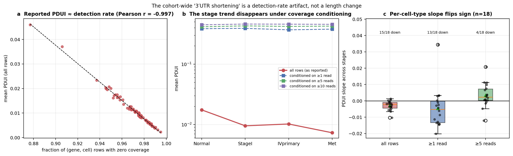

*Figure 12.1: (a) reported mean PDUI against the zero-coverage fraction, one point
per (cell type, stage); (b) the stage trajectory unconditionally and under
coverage conditioning; (c) per-cell-type stage slopes under each conditioning.*

Three results, in order of severity:

1. **Reported PDUI is almost exactly the detection rate.** Across all 76
   (cell type, stage) observations, mean PDUI correlates with the zero-coverage
   fraction at **Pearson r = −0.997** (p = 3.9 × 10⁻⁸³; Spearman −0.994) and with
   mean reads per row at r = +0.982. Roughly 99% of the variance in the quantity
   being interpreted as 3′UTR biology is explained by how often anything was
   detected at all.
2. **Conditioning removes the trend.** Restricted to rows with ≥1 read, mean PDUI
   is 0.387 / 0.392 / 0.370 / 0.380 across Normal → StageI → IVprimary → Met —
   flat, and no longer correlated with depth (r = −0.081, p = 0.48), confirming
   the conditioning works. At ≥5 reads the ordering is 0.416 / 0.430 / 0.422 /
   0.426: if anything the metastatic samples sit *above* normal.
3. **The sign of the per-cell-type slope is not robust.** Using all rows, 15/18
   cell types with ≥3 stages trend downward (Wilcoxon p = 3.3 × 10⁻⁴). At ≥1 read
   it is 13/18 (p = 0.034). At ≥5 reads it is **4/18** — the effect reverses, with
   mean slope +0.0034.

> **Conclusion.** The cohort-level direction of 3′UTR length change is determined
> by the coverage threshold, not by the data. The reported shortening is a
> restatement of the fact that metastatic and late-stage libraries in this cohort
> are shallower per cell. **No claim of global 3′UTR shortening in this dataset is
> supportable**, and the magnitude (|slope| ≈ 0.003 on a 0–1 scale) would be
> negligible even if the direction held. This confirms the project's earlier
> suspicion and upgrades it from caveat to finding.
>
> What would rescue a length claim: per-gene tests restricted to genes with
> adequate coverage in *both* compared stages, with depth explicitly modelled as a
> covariate, on cells matched for library size. That analysis is not in this sweep.

### 12.2 Stage trajectory per cell type

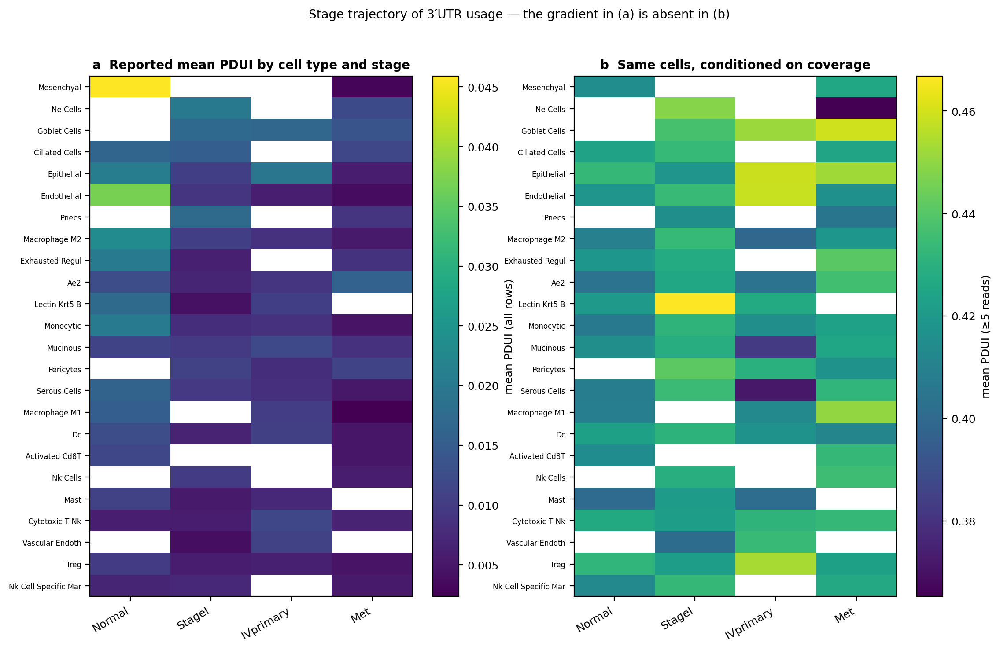

*Figure 12.2: mean PDUI by cell type and stage, as reported (a) and conditioned on
≥5 reads (b), same cells and same ordering. The left-to-right gradient in (a) is
the detection-rate gradient; it is absent in (b).*

The cell types with the steepest apparent shortening — mesenchymal
(0.046 → 0.003), endothelial (0.037 → 0.004), macrophage M2 (0.023 → 0.005) — are
those with the largest drop in per-cell coverage between Normal and Met. Cell
types are also unevenly represented across stages: 8 of 24 lack at least one
stage entirely, so several "trends" are two-point slopes. Mesenchymal, the
steepest of all, is fitted on **two** stages.

### 12.3 Differential-APA significance indexes power, not effect

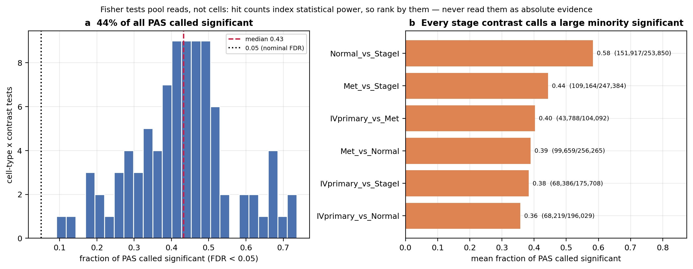

*Figure 12.3: (a) distribution of the per-(cell type, contrast) significance rate;
(b) mean significance rate by stage contrast.*

Across 1,233,328 Fisher tests, **541,133 (43.9%) are significant at FDR < 0.05**.
By contrast:

| contrast | cell types | tests | significant | mean fraction |
|---|---|---|---|---|
| Normal vs StageI | 15 | 253,850 | 151,917 | 0.583 |
| Met vs StageI | 18 | 247,384 | 109,164 | 0.444 |
| Met vs Normal | 16 | 256,265 | 99,659 | 0.389 |
| IVprimary vs Met | 13 | 104,092 | 43,788 | 0.403 |
| IVprimary vs StageI | 15 | 175,708 | 68,386 | 0.384 |
| IVprimary vs Normal | 13 | 196,029 | 68,219 | 0.357 |

A finding that 44% of all polyadenylation sites are differentially used between
two stages of the same tumour is not biologically credible. It is the expected
signature of **pseudoreplication**: the Fisher contingency table is built over
*reads*, so the effective sample size is read depth rather than the number of
cells or patients. Adding sequencing depth to the same biological material
increases significance without adding evidence. The project has separately
measured this dependence at ρ = +0.68 between significance and depth.

Two consequences for how these tables may be used:

- **Rank, never threshold.** Hit counts order cell types and contrasts by how much
  evidence was available. They do not license "gene X is differentially
  polyadenylated between Normal and Met."
- **The largest contrast is the best-powered one, not the most different.**
  Normal vs StageI tops the table at 58.3%; Normal and Stage I are also the two
  deepest strata.

Effect sizes (`delta_proportion`, `odds_ratio`) are reported per PAS and are the
appropriate quantity to inspect, but note that `odds_ratio` is frequently `inf`
where one stage has zero reads — another consequence of the sparsity documented in
§12.1.

### 12.4 Recurrent versus cell-type-private switches

Using the per-gene stage-trend tables across all 24 cell types (8,441 genes with
at least one trend call; `|Spearman| ≥ 0.8` defines "trending"):

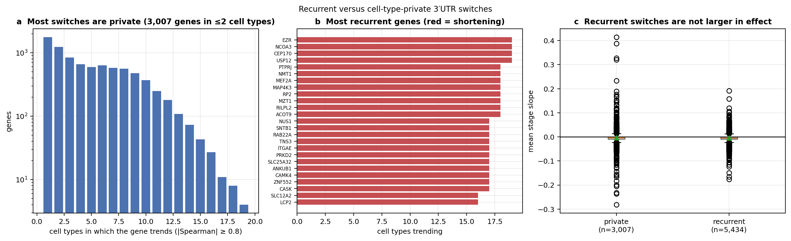

*Figure 12.4: (a) how many cell types each gene trends in; (b) the 25 most
recurrent genes; (c) effect size of recurrent versus private genes.*

- **3,007 genes (35.6%) are private**, trending in ≤2 cell types.
- **5,434 genes trend in ≥3** cell types; of these 4,915 (90.5%) are dominantly
  decreasing, with median direction consistency 0.857.
- The most recurrent genes (19 of ≤24 cell types) are **EZR, NCOA3, CEP170,
  USP12**, followed at 18 by **NMT1, MEF2A, MAP4K3, RP2, MZT1, RILPL2, ACOT9,
  PTPRJ**. Symbols are resolved from the exact GTF the run used
  (Ensembl GRCh38.99), not inferred.
- **Recurrence is not driven by effect size.** Private genes have *larger* mean
  |slope| than recurrent ones (0.0137 vs 0.0104; Mann–Whitney p = 0.029) — the
  opposite of what a real, shared biological program would produce, and what is
  expected if private calls are noisier estimates from fewer cells.

The honest reading is that recurrence here measures **testability**, not shared
regulation: a gene trends in many cell types largely when it is detected in many
cell types. The number of cell types in which a gene is even tested ranges from
1 to 24 (median 10), so `n_celltypes_trending` must be read against
`n_celltypes_tested` — both are reported in
`cumulative_analysis/extra/recurrence_decomposition.csv`. Note also that
individual genes carry internally inconsistent summaries (PTPRJ is dominantly
decreasing in 15/18 cell types yet has mean slope +0.030), because a small number
of saturated 0→1 flips dominate the mean.

Given §12.1, none of these genes should be described as "shortening in LUAD
progression." The defensible statement is that they are the genes whose PAS usage
is measurable across the most cell types — a candidate list for a properly
depth-controlled re-analysis, not a result.


### 12.5 Does the lost distal 3′UTR carry regulatory elements?

The mechanistic story attached to 3′UTR shortening (Mayr & Bartel 2009;
Sandberg 2008) is that the removed distal segment carries miRNA sites and AU-rich
elements, so losing it de-represses the transcript. That is a sequence claim, and
it is testable directly against the genome the run used — no external prediction
service, no site-conservation model.

For every gene with a proximal/distal PAS pair in the classic PDUI layer
(n = 3,641), the segment between the two sites — present only in the long isoform,
removed by shortening — was extracted from `Homo_sapiens.GRCh38.dna.primary_assembly.fa`
in mRNA-sense orientation, together with a **length-matched control** taken
immediately upstream of the proximal PAS. Both were scanned for the class-II ARE
pentamer `ATTTA`, the high-confidence `WTTTATTTAW` nonamer, and 7mer-m8 seed
matches for six miRNA families (seeds computed in code from the mature sequences,
so every site is auditable).

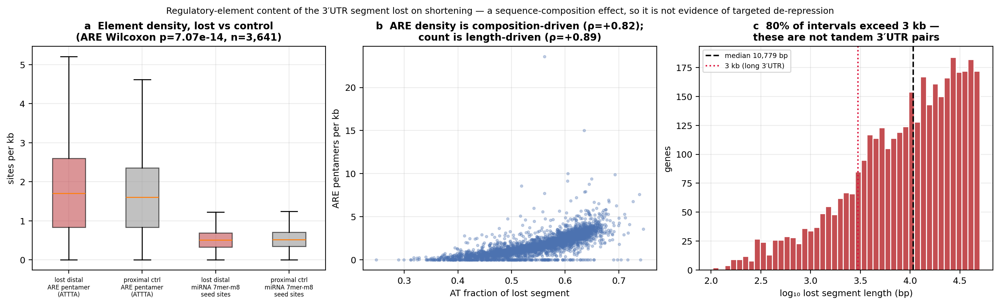

*Figure 12.5: (a) element density in the lost segment versus the length-matched
proximal control; (b) ARE density against AT content; (c) length distribution of
the intervals being scanned.*

| measure | lost segment (median) | control (median) | Wilcoxon p |
|---|---|---|---|
| ARE pentamer, count | 16.0 | 17.0 | 4.8 × 10⁻¹⁸ |
| ARE pentamer, per kb | 1.703 | 1.603 | 7.1 × 10⁻¹⁴ |
| ARE nonamer `WTTTATTTAW`, count | 1.0 | 0.0 | 0.63 |
| miRNA 7mer-m8 seed sites, count | 6.0 | 6.0 | 4.1 × 10⁻³ |
| miRNA seed sites, per kb | 0.510 | 0.520 | **0.058** |
| AT fraction | 0.562 | 0.548 | 1.4 × 10⁻⁵³ |

**The mechanism is not supported by this data.**

1. **No miRNA-site enrichment.** Seed-site density in the lost segment is
   0.510/kb versus 0.520/kb in the control — statistically indistinguishable
   (p = 0.058) and pointing the *wrong way*. Whatever else shortening does here, it
   does not preferentially remove miRNA seed matches.
2. **The ARE excess is a composition effect.** ARE density is nominally higher in
   the lost segment (1.70 vs 1.60 per kb) and the p-value is small because n is
   large, but the effect is 6% relative. It is fully accounted for by the lost
   segment being slightly more AT-rich (0.562 vs 0.548): ARE density tracks AT
   fraction at Spearman ρ = +0.82, and raw ARE count tracks segment length at
   ρ = +0.89. An `ATTTA` pentamer is expected by chance roughly once per 250 bp in
   55% AT sequence; the observed ~1.7/kb is close to that background. The
   functional nonamer shows no difference at all (p = 0.63).
3. **The interval being scanned is mostly not 3′UTR.** The median proximal-to-distal
   span is **10,779 bp** (IQR 3,867–24,497), and **80% exceed 3 kb** — longer than
   almost any real human 3′UTR. These PAS pairs are therefore not predominantly
   tandem 3′UTR sites: many span introns or whole gene bodies, so the "lost 3′UTR"
   is frequently not UTR sequence. Any element count over such intervals measures
   genomic background, not UTR regulatory content.

Point 3 is the important one and it is a **pipeline finding, not a biology
finding**: the classic PDUI layer is pairing PAS that are too far apart to be a
tandem UTR pair. Restricting PDUI to proximal/distal pairs within the annotated
3′UTR of the same transcript — which the GTF already provides — is a prerequisite
for any length or mechanism claim. Until that is done, the de-repression mechanism
can be neither supported nor refuted here; what can be said is that the current
intervals show no targeted regulatory-element loss beyond sequence composition.

> **Scope of this test.** A seed-match scan is an upper bound on candidate sites: it
> ignores site conservation, 3′UTR accessibility, and context features that
> TargetScan models, and it does not weight by miRNA expression in these cell types.
> It is used here in the direction it is valid — a *negative* result (no enrichment)
> is meaningful, whereas a positive one would have needed follow-up.

### 12.6 Cancer-gene and pathway themes of the recurrent switch genes

The biological-findings report leans on two claims that were never tested against
a background: that the switch genes are enriched for known cancer genes, and that
they share pathway themes. Both are testable, and both are **negative** once the
confound from §12.4 is handled.

Reference sets are fetched from public endpoints and cached under
`cumulative_analysis/refs/`: the **OncoKB cancer gene list** (1,245 genes, which
carries the `sangerCGC` flag — membership of the **COSMIC Cancer Gene Census**,
581 genes — plus ONCOGENE/TSG typing) and the **50 MSigDB Hallmark** sets.

**The confound.** §12.4 established that recurrence tracks *detectability*.
Detectability is driven by expression level, and cancer-gene catalogues and
Hallmark sets are themselves biased toward well-studied, highly expressed genes. A
"recurrent switch genes vs all genes" test would recover expression bias and
report it as cancer biology. Two guards are applied: the universe is restricted to
the 8,441 genes that actually carry a trend call, and detectability
(`n_celltypes_tested`) is adjusted for by logistic regression.

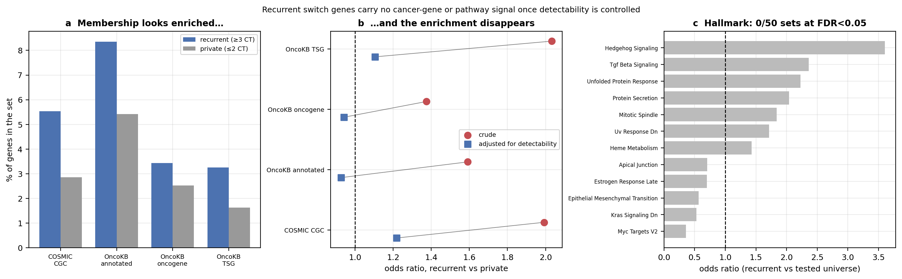

*Figure 12.6: (a) raw membership rates; (b) crude versus detectability-adjusted
odds ratios; (c) Hallmark enrichment of the recurrent set against the tested
universe.*

| gene set | recurrent | private | crude OR | p | **adjusted OR** | **p** |
|---|---|---|---|---|---|---|
| COSMIC CGC | 301/5,434 (5.54%) | 86/3,007 (2.86%) | 1.99 | 6.7 × 10⁻⁹ | **1.22** | **0.28** |
| OncoKB annotated | 454/5,434 (8.36%) | 163/3,007 (5.42%) | 1.59 | 4.8 × 10⁻⁷ | **0.93** | **0.60** |
| OncoKB oncogene | 187/5,434 (3.44%) | 76/3,007 (2.53%) | 1.37 | 0.022 | **0.94** | **0.78** |
| OncoKB TSG | 177/5,434 (3.26%) | 49/3,007 (1.63%) | 2.03 | 5.7 × 10⁻⁶ | **1.10** | **0.68** |

**Every apparent enrichment is accounted for by how many cell types could test the
gene.** The crude odds ratios look convincing — a doubling of Cancer Gene Census
membership at p = 6.7 × 10⁻⁹ is exactly the kind of number that gets reported as a
finding. After adjusting for detectability all four collapse to the null, two of
them below 1.0. There is no cancer-gene signal in the recurrent switch set.

**No pathway themes either.** Of the 50 Hallmark sets, **0 reach FDR < 0.05**
against the tested universe. The nominally strongest are Mitotic Spindle
(OR 1.84, q = 0.080), Unfolded Protein Response (OR 2.23, q = 0.097) and Protein
Secretion (OR 2.04, q = 0.097) — none survives multiple testing, and all three are
high-expression housekeeping-adjacent programs, which is what detectability bias
predicts.

**Direction carries no oncogene/TSG asymmetry.** If shortening de-repressed
oncogenes, shortening genes should skew oncogene and lengthening genes skew tumour
suppressor. They do not: shortening genes split 236 oncogenes to 205 TSGs and
lengthening genes 27 to 21 (OR 0.90, p = 0.76). This is expected — §12.1 showed
direction is a detection-rate artifact, so it cannot carry a functional signal.

> **Why the matched-resampling control is reported but not used.** The script also
> computes a detectability-matched null by resampling private genes stratified on
> `n_celltypes_tested`. It is flagged **UNRELIABLE** in the output, and it should
> be: recurrent and private genes barely overlap on that variable — median
> `n_celltypes_tested` is **18 for recurrent versus 2 for private**, and strata
> 17–24 contain 3,337 recurrent genes against **30** private ones. Resampling with
> replacement from strata of 2–3 genes produces a "null" fixed by a handful of
> genes, which is why that column disagrees with itself across sets (3.6% for CGC,
> 11.3% for OncoKB). The near-total non-overlap is itself the point: on this data
> recurrence and detectability are close to the same variable, and no test can
> fully separate them. The logistic adjustment is reported as the primary result
> because it is stable, but it is adjusting across a thin overlap region and its
> null result should be read as "no evidence of enrichment," not as a precise zero.

**Consequence for the biological narrative.** The gene-level story in
`PeakATail_Laughney_Biological_Findings.md` — curated oncogene-shortening and
tumour-suppressor-lengthening tables — has no statistical support at the cohort
level. Individual genes there may still be real, but they were selected by
inspection from a set with no detectable enrichment, so the selection cannot be
justified by the aggregate.

---

## 13. Experiment matrix — what was run, and with which parameters

Every row below is reconstructed from the runs themselves
(`reports/build_experiment_matrix.py` reads the 19 `run_manifest.json` files and
their `resolved_config`), not from the sweep definition, so it records what the
pipeline *did* rather than what it was asked to do. Full per-run parameters —
46 fields including every peak-calling hyperparameter — are in
`cumulative_analysis/experiment_matrix.csv`.

**Common to all runs:** GTF `Homo_sapiens.GRCh38.99.gtf`; atlas
`polyasite_3.0_GRCh38_ensembl_sorted.bed` at `atlas_distance = 50`;
`merge_strategy: before` per dataset (technical replicates / lanes of one
library); the `original` peak strategy excluded throughout.

### A. Peak-calling grid (5 runs, full 17-dataset cohort input)

| run | strategy | atlas mode | ip mode | max PAS/peak | λ window | λ method | fold-change | PAS gap | min prominence |
|---|---|---|---|---|---|---|---|---|---|
| `lg_ip_filter` | lambda_gradient | annotate | filter | 5 | 5000 | median | 2.0 | 100 | 5.0 |
| `lg_ip_off` | lambda_gradient | annotate | off | 5 | 5000 | median | 2.0 | 100 | 5.0 |
| `lp_annotate` | lambda_poisson | annotate | annotate | 5 | 5000 | median | 2.0 | 100 | 5.0 |
| `si_annotate` | sierra_iterative | annotate | annotate | 5 | 5000 | median | 2.0 | 100 | 5.0 |
| `lg_annotate` | lambda_gradient | annotate | annotate | 5 | 5000 | median | 2.0 | 100 | 5.0 |

### B. Trim / annotation-window branches

| branch | max_gene_distance | utr_multiplier | include_extended |
|---|---|---|---|
| `A2_trim_d10000_ext` | 10000 | 2.0 | yes |
| `A2_trim_d1000_ext` | 1000 | 2.0 | yes |
| `A2_trim_d2000_ext` | 2000 | 2.0 | yes |
| `A2_trim_d3000_ext` | 3000 | 2.0 | yes |
| `A2_trim_d5000_ext` | 5000 | 2.0 | yes |
| `A2_trim_default` | 5000 | 2.0 | no |
| `A2_trim_mult1.5` | 5000 | 1.5 | no |
| `A2_trim_mult3.0` | 5000 | 3.0 | no |

### C. Clustering branches

| branch | method | resolution | n_neighbors |
|---|---|---|---|
| `A3_libsize` | leiden_libsize | 1.0 | 30 |
| `A3_nn15` | leiden_tfidf | 1.0 | 15 |
| `A3_nn50` | leiden_tfidf | 1.0 | 50 |
| `A3_res0.5` | leiden_tfidf | 0.5 | 30 |
| `A3_res2.0` | leiden_tfidf | 2.0 | 30 |

### D. Cell-level filters (identical across all runs unless noted)

| filter | value |
|---|---|
| `min_read` | 1500 |
| `min_cells` | 3 |
| `min_genes` | 50 |
| `min_pas_per_cell` | 50 |

### E. Cohort and switch layer

| item | value |
|---|---|
| datasets | 17 GSM libraries (`B1_cohort_full`), 8 BAMs each |
| stages | Normal, StageI (IA/IB/IIA), IVprimary, Met (bone/brain) |
| cell types | 24, signature-scored (Wansleeben/Hogan 2013 + lung-epithelial + stem-cell signatures) |
| GEX cross-check | `B2_gex_celltyping`, 17 datasets, PAS-vs-GEX concordance |
| switch layers | `B3_switch/{diff, length, trend}` per cell type |
| diff strategies | `fisher` (6 stage contrasts), `nb_multi` (omnibus) |
| length strategies | `classic` (PDUI), `proportion`, `shannon` |
| stage contrasts | 6 pairwise (`experiments/laughney/contrasts.tsv`) |

Note that **`nb_pairwise` was not run** in this sweep, so the three-way
diff-strategy comparison in the superseded Figure 17 cannot be reproduced; §8
compares `fisher` against `nb_multi` only.

### Two provenance traps worth recording

Both were found while building the matrix, and are encoded in the script rather
than silently corrected:

1. **`ip_filter_mode` does not identify the internal-priming arm.** It remains
   `"annotate"` even when the filter is disabled; the real switch is the boolean
   `ip_filter`. The matrix therefore derives `ip_mode_effective`. This also
   explains the Jaccard = 1.000 between `lg_annotate` and `lg_ip_off` reported in
   §6.3: in `annotate` mode the filter only *labels* peaks and removes none, so
   turning it off entirely produces byte-identical output. Comparing the two
   resolved configs directly, they differ in exactly two fields — `ip_filter`
   (True/False) and `genome_fasta` (path/None) — so `lg_ip_off` genuinely loaded
   no genome and ran no scan, and *still* returned the same 22,633 peaks. The
   nominally three-level ip axis is really two-level: `filter` versus everything
   else.

2. **The re-annotation branches' manifests describe their base run.** `A2_*` and
   `A3_*` re-annotate an existing run, and their `run_manifest.json` carries the
   *base* run's args. Read naively, all eight trim branches report
   `max_gene_distance = 5000` and every clustering branch `resolution = 1.0` —
   the varied axis disappears entirely. For those 13 runs `trim_cluster_grid.tsv`
   is authoritative; the matrix overwrites the varied columns from it and records
   this in a `param_source` column. **Any future audit that reads only the
   manifests will silently conclude these branches were identical.**

### Defined but not executed

The `sweep_grid.tsv` filter-threshold arm — 18 branches (`SWb_min_read_*`,
`SWb_min_cells_*`, `SWb_min_pas_per_cell_*`, `SWb_max_gene_distance_*`,
`SWb_utr_multiplier_*`) — was defined but **never run** in this sweep. The
cell-level filters in table D are therefore fixed at a single setting throughout,
and no claim in this report is supported by a filter-threshold sensitivity
analysis. Sensitivity to `max_gene_distance` and `utr_multiplier` *is* covered, by
the `A2_*` branches in table B.

---

## 14. Filter-effect comparison — *pending*

> **Status: experiment running; this section is a placeholder and contains no
> results.** Nothing here may be cited until it is filled in.

A separate run is executing the **full pipeline** (peak calling → clustering →
GEX cell-typing → switch `diff` + `length` + `trend`) on the 6-GSM subset under
four filtering scenarios, to measure how each filter propagates through to the
biological readout rather than only to peak counts:

| scenario | filter applied |
|---|---|
| baseline | `atlas_mode: annotate`, `ip_filter: annotate` — label only, remove nothing |
| atlas-filter | drop PAS with no atlas support within `atlas_distance` |
| annot-filter | drop PAS outside the GTF-annotated 3′UTR |
| ip-filter | drop PAS flagged as internal-priming by the genome FASTA scan |

It will report, per scenario: (a) PAS retained and cluster structure (n clusters,
ARI/AMI against the GEX labels), (b) differential-APA hit counts by stage
contrast, and (c) the shortening/lengthening split and slope distribution across
cell types.

**Why this matters given §6 and §12.** §6.2 showed that F1 against a saturated
reference *penalises* a filter that removes false positives, so filters cannot be
evaluated on atlas agreement at all. The question that does matter is whether a
filter changes the biological readout — and §12.5 gives a concrete reason to
expect the annot-filter to matter most: 80% of the proximal/distal PAS pairs
currently driving PDUI span more than 3 kb, which restricting to the annotated
3′UTR would directly address.

Three predictions are recorded here **in advance**, so the result reads as a test
rather than a description:

- **Clustering should be robust.** §6.4 found mean clusters per dataset varying by
  only 0.24 across the whole trim grid.
- **Differential hit counts should fall roughly in proportion to the PAS
  removed**, if §12.3 is right that they index power rather than effect. A fall
  much steeper than the PAS reduction would instead indicate the removed PAS
  carried disproportionate signal.
- **The shortening/lengthening split should move most under annot-filter**, and
  should move toward the depth-conditioned result in §12.1 (no consistent
  direction) if the current split is driven by over-long PAS pairs.

If instead the split is *unchanged* across all four scenarios, that strengthens
§12.1's conclusion that the direction is set by coverage rather than by which PAS
are included.

## Appendix: Figure Index

### Corrected figure set (current)

Regenerated by `python reports/generate_corrected_figures.py`; all under
`figures/corrected/`. Each is also written as `.svg`.

| # | Description | File | Source table |
|---|-------------|------|--------------|
| C1 | Strategy benchmark + count confound | `01_strategy_benchmark.png` | `tables/strategy_comparison.csv` |
| C2 | Reference saturation (precision/recall) | `02_atlas_saturation.png` | `tables/strategy_comparison.csv` |
| C3 | Count-controlled rarefaction + distance | `03_count_controlled.png` | `extra/strategy_rarefaction.csv`, `extra/pas_distance_to_atlas.csv` |
| C4 | Internal priming + trim sensitivity | `04_ip_and_trim.png` | `tables/ip_filter_axis.csv`, `tables/trim_comparison.csv` |
| C5 | Clustering params + GEX concordance | `05_clustering.png` | `tables/clustering_comparison.csv`, `tables/gex_concordance.csv` |
| C6 | **Depth confound (headline)** | `06_depth_confound.png` | `extra/depth_confound_by_celltype_stage.tsv` |
| C7 | Stage trajectory, raw vs conditioned | `07_stage_trajectory.png` | `tables/celltype_stage_pdui_matrix.csv`, `extra/depth_confound…tsv` |
| C8 | Fisher significance vs power | `08_fisher_power.png` | `tables/fisher_hits_by_celltype_contrast.csv` |
| C9 | Recurrent vs private switches | `09_recurrence.png` | `extra/recurrence_decomposition.csv` |
| C10 | Lost distal segment element scan | `10_lost_distal_elements.png` | `extra/lost_distal_element_scan.csv` |
| C11 | Cancer-gene + Hallmark characterisation | `11_gene_sets.png` | `extra/cancer_gene_overlap.csv`, `extra/hallmark_enrichment.csv` |
| C12 | Differential-strategy comparison (fisher vs nb_multi) | `12_diff_strategy.png` | `extra/diff_strategy_summary.tsv`, `extra/diff_strategy_overlap.tsv` |
| C13 | Length-metric comparison (classic/proportion/shannon) | `13_length_strategy.png` | `extra/length_strategy_summary.tsv` |
| C14 | Per-gene PAS usage by stage | `14_gene_walk.png` | `extra/gene_walk_tracks.tsv` |

### Superseded figure set

> **Withdrawn for all data panels.** These predate the pipeline fixes and have no
> reproducible generator. Only the pure schematics — pipeline flow, strategy
> cartoon, math methods, TF-IDF diagram, and the `*_explainer` cartoons — remain
> valid as method illustrations.

| # | Description | File | Status |
|---|-------------|------|--------|
| 1 | Strategy explained | `fig_strategy_explained.png` | CONCEPT — valid |
| 2 | Math methods | `fig_math_methods.png` | CONCEPT — valid |
| 3 | Peak counts | `fig_peak_counts.png` | **DATA — withdrawn** |
| 4 | Annotation impact | `fig_annotation_impact.png` | **DATA — withdrawn** |
| 5 | Dual DB validation | `fig_dual_db_validation.png` | **DATA — withdrawn** |
| 6 | Precision metrics table | `fig_dual_db_table.png` | **DATA — withdrawn** |
| 7 | Precision by distance | `fig_precision_v3.png` | **DATA — withdrawn** |
| 8 | Distance histogram | `fig_distance_hist.png` | **DATA — withdrawn** |
| 9 | Strategy overlap Venn | `fig_venn_overlap.png` | **DATA — withdrawn** |
| 10 | Parameter sensitivity | `fig_metrics_table.png` | **DATA — withdrawn** |
| 11 | ARI/AMI resolution sweep | `fig_ari_ami_sweep.png` | **DATA — withdrawn** |
| 12 | 6-panel clustering comparison | `fig_main_comparison.png` | **DATA — withdrawn** |
| 13 | Sankey flow diagram | `fig_sankey.png` | **DATA — withdrawn** |
| 14 | Cluster sizes | `fig_cluster_sizes.png` | **DATA — withdrawn** |
| 15 | APA subclusters | `fig_subcluster.png` | **DATA — withdrawn** |
| 16 | Differential APA (PDUI + volcano) | `fig_differential_apa.png` | **DATA — withdrawn** |
| 17 | Switch strategy explainer (cartoon) | `switch_strategy_explainer.png` | CONCEPT — valid |
| 18 | Length strategy explainer (cartoon) | `length_strategy_explainer.png` | CONCEPT — valid |
| 19 | Switch strategy real-data comparison | `switch_strategy_real_data.png` | **DATA — replaced by C12** |
| 20 | Length strategy real-data comparison | `length_strategy_real_data.png` | **DATA — replaced by C13** |
| 21 | Gene walk: DPYD | `gene_walk_ENSG00000188641.png` | **DATA — replaced by C14** |
| 22 | Gene walk: PHACTR1 | `gene_walk_ENSG00000112137.png` | **DATA — replaced by C14** |
| 23 | PDUI distribution (classic) | `length_pdui_distribution_classic.png` | **DATA — replaced by C13** |
| 24 | Entropy distribution (shannon) | `length_entropy_distribution_shannon.png` | **DATA — replaced by C13** |
| 25 | Proportion heatmap | `length_proportion_heatmap.png` | **DATA — replaced by C13** |
| 26 | Classic shifts, cluster pairs | `length_shifts_classic_cluster_pairs.png` | **DATA — replaced by C13** |
| 27 | Geneview with isoforms: DPYD | `geneview_with_isoforms_DPYD.png` | **DATA — replaced by C14** |
| 28 | Geneview: CLIC2, 3 PAS | `geneview_CLIC2_3pas.png` | **DATA — replaced by C14** |

> These six appear in the LaTeX report only. Every one carries a
> `[PRE-FIX RUN — illustrative only]` caption prefix in the .tex; they are kept
> because they illustrate the *shape* of each length metric's output, not because
> their values are usable.
